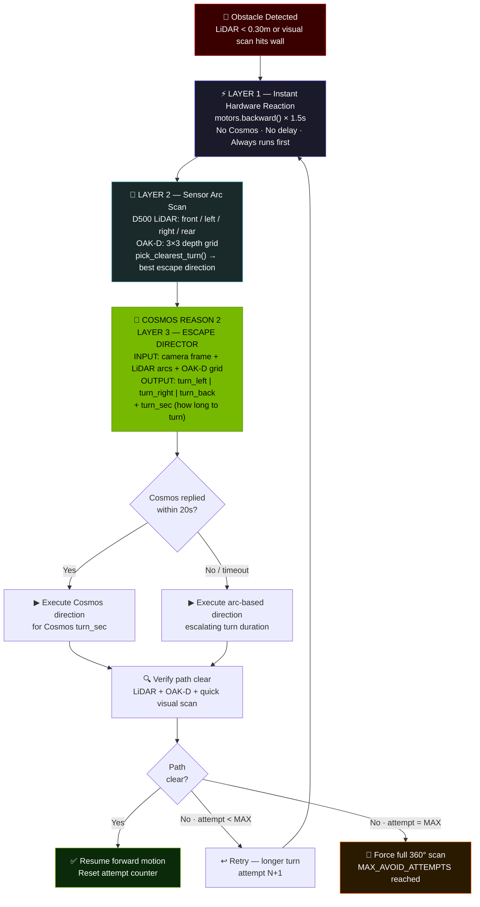
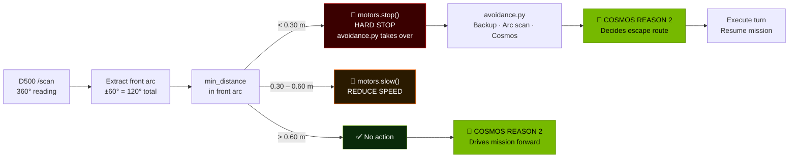
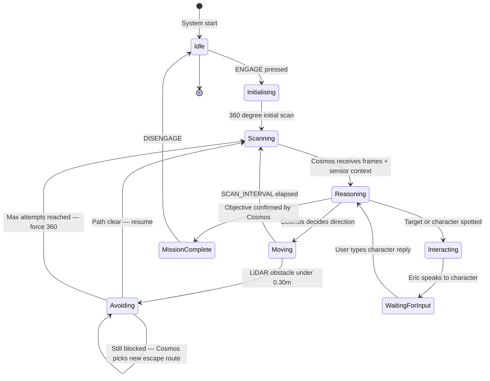
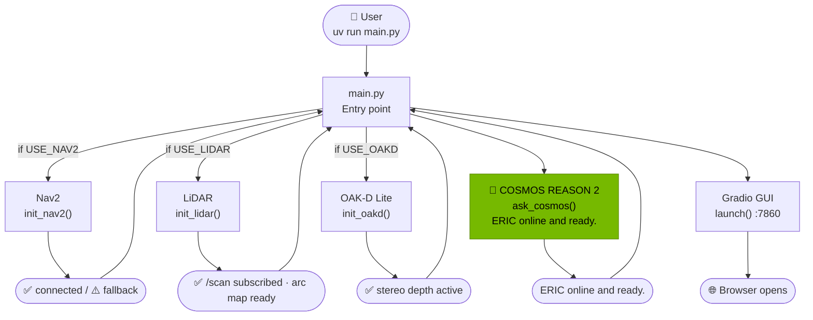
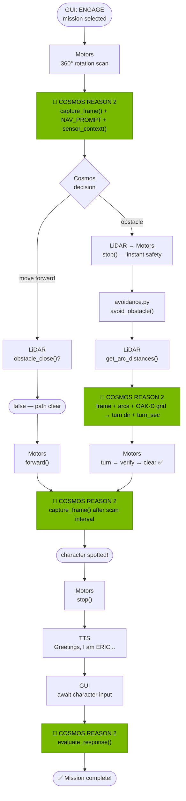
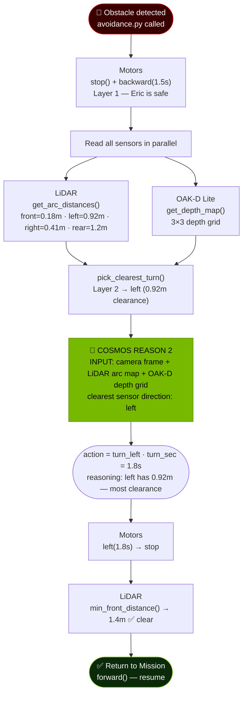
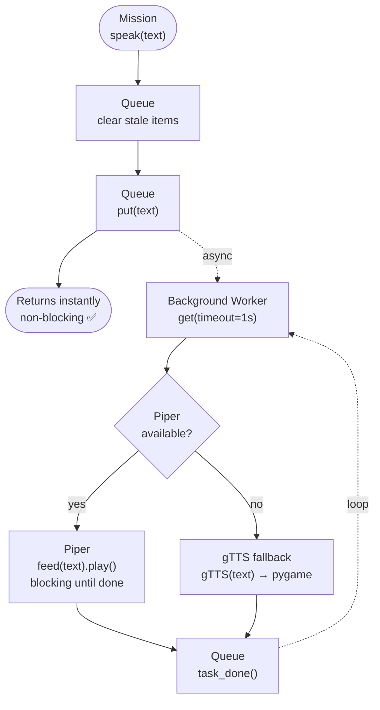

# ERIC — Edge Robotics Innovation by Cosmos
**By OppaAO**
**License: Apache 2.0**

[](https://github.com/OppaAI/eric)


[](https://www.gnu.org/licenses/gpl-3.0.en.html)


**NVIDIA Cosmos Cookoff 2026 Entry**

ERIC is a search and rescue ground robot powered by NVIDIA Cosmos Reason 2, running fully at the edge on a sub-$1000 CAD Jetson Orin Nano Super 8GB. No cloud. No server. Just a tracked robot reasoning about the physical world in real time.

Cosmos Reason 2 is the mission brain — it sees the world through Eric's cameras, reasons about what it finds, decides where to go, and actively directs the escape route when obstacles are hit. The D500 LiDAR and OAK-D Lite provide an independent safety layer. ROS2 Nav2 handles path planning when enabled.

## Demo

**Mission: Find Princess Leia**

Eric navigates a Star Wars Lego scene autonomously — scanning with dual cameras, reasoning with Cosmos Reason 2 about what it sees, talking to characters to gather mission information, and manoeuvring around obstacles using the new 3-layer avoidance system. Entire demo recorded from the Gradio GUI screen — no outdoor filming needed. Judges see both live camera feeds, reasoning, motor telemetry, and LiDAR status simultaneously.

## Hardware

| Component | Details |
|---|---|
| SBC | Jetson Orin Nano Super 8GB |
| Robot | Waveshare UGV Beast (tracked-wheels) |
| LiDAR | D500 (360°, reactive obstacle safety + arc map) |
| Depth Camera | OAK-D Lite (3D perception, 3×3 depth grid) |
| Camera 1 | Webcam (close-up scanning) |
| Camera 2 | Pan-tilt wide-angle (navigation + overview) |
| TTS | Piper danny-low (CPU, zero VRAM) |


## Stack

| Component | Role |
|---|---|
| Cosmos Reason 2 (2B W4A16) via vLLM | Vision + physical reasoning — mission brain + avoidance director |
| ROS2 Humble + Nav2 | Autonomous path planning (optional) |
| D500 LiDAR → ROS2 /scan | Reactive obstacle safety + 4-arc distance map for avoidance |
| OAK-D Lite | Stereo depth — 3×3 grid fed to Cosmos + avoidance planner |
| avoidance.py | 3-layer smart avoidance: backup → arc scan → Cosmos decision |
| Piper via RealtimeTTS | Streaming TTS, CPU only, zero VRAM |
| Gradio | Dual camera + LiDAR status + mission control UI |
| Waveshare ESP32 serial UART | Motor + OLED + LED + pan-tilt control |

---

## Cost
| Component | Price |
|---|---|
| Hardware   | < $1000 CAD  |
| Software   |     FOSS     |
| Experience |   Priceless  |

---

## Architecture

### System Overview

```mermaid
flowchart TD
    COSMOS["🧠 COSMOS REASON 2<br/>MISSION BRAIN + AVOIDANCE DIRECTOR<br/>Sees · Reasons · Decides · Escapes"]

    subgraph SENSORS["Sensor Layer"]
        LIDAR["📡 D500 LiDAR<br/>360° /scan · Arc map F/L/R/Rear"]
        OAKD["📷 OAK-D Lite<br/>Stereo Depth · 3×3 grid"]
        CAM1["🎥 Webcam<br/>Close-up"]
        CAM2["🎥 Pan-tilt Cam<br/>Wide angle"]
    end

    subgraph AVOIDANCE["🚧 Smart Avoidance — avoidance.py"]
        AV1["Layer 1 · Instant backup<br/>No Cosmos needed"]
        AV2["Layer 2 · LiDAR arc scan<br/>Pick clearest direction"]
        AV3["Layer 3 · Cosmos decides<br/>Camera + all sensor data"]
        AV1 --> AV2 --> AV3
    end

    subgraph SAFETY["⚠️ Independent Safety Layer"]
        LIDAR_MON["LiDAR Safety Monitor<br/>lidar.py — instant stop / slow"]
        OAKD_MON["OAK-D Depth Monitor<br/>oakd.py"]
    end

    subgraph NAV["Navigation Layer"]
        NAV2["🗺️ ROS2 Nav2<br/>Path Planning + SLAM (optional)"]
        DIRECT["⚡ Direct Motor Control<br/>(fallback)"]
    end

    MOTORS["🤖 ESP32 Motors — Waveshare UGV Beast UART"]

    CAM1 --> COSMOS
    CAM2 --> COSMOS
    OAKD --> OAKD_MON
    LIDAR --> LIDAR_MON
    LIDAR --> AV2
    OAKD --> AV2
    CAM2 --> AV3

    COSMOS -->|"goal pose / direction"| NAV2
    COSMOS -->|"fallback: move cmds"| DIRECT
    COSMOS -->|"triggers avoidance"| AVOIDANCE
    AV3 -->|"escape: turn dir + turn_sec"| MOTORS

    NAV2 -->|cmd_vel| MOTORS
    DIRECT --> MOTORS

    LIDAR_MON -->|"< 0.30m STOP · < 0.60m SLOW"| MOTORS
    OAKD_MON -->|"depth context"| COSMOS
    AVOIDANCE --> MOTORS

    style COSMOS fill:#76b900,stroke:#5a8a00,color:#000000
    style AV3 fill:#4a7a00,stroke:#76b900,color:#ffffff
    style SAFETY fill:#3a1a1a,stroke:#cc4444
    style AVOIDANCE fill:#1a2a1a,stroke:#76b900
```



### Smart Obstacle Avoidance Pipeline



### Obstacle Safety — Full Decision Flow



### Mission State Machine



---

## Sequence Diagrams

> Sequence diagrams use flowchart format so Cosmos Reason 2 nodes can be highlighted in NVIDIA green throughout.

### Startup Sequence



### Mission Loop — One Reasoning Cycle



### Avoidance Deep-Dive — Cosmos as Escape Director



### TTS Pipeline



---

## Project Structure

```
eric/
├── main.py                   # Entry point — initializes Nav2, LiDAR, Cosmos, GUI
├── config.py                 # All configuration (env vars + ROS2 flags)
├── cosmos.py                 # Cosmos Reason 2 API, camera, digital zoom crop
├── motors.py                 # Waveshare serial motor control + OLED + LED
├── tts.py                    # Piper streaming TTS (CPU, zero VRAM)
├── mission.py                # Mission state machine + YAML loader
├── avoidance.py              # 3-layer smart avoidance — Cosmos as escape director (NEW)
├── nav2.py                   # ROS2 Nav2 integration (graceful fallback)
├── lidar.py                  # D500 LiDAR safety monitor + raw scan → arc map
├── oakd.py                   # OAK-D Lite stereo depth + 3×3 depth grid
├── gui.py                    # Gradio cockpit dashboard UI
├── missions/
│   ├── template.yaml         # Start here — fully commented
│   ├── star_wars.yaml        # Find Princess Leia
│   ├── anakin_training.yaml  # Eric IS Anakin, faces dark side choice
│   ├── search_rescue.yaml    # Lost hiker rescue
│   └── office_mystery.yaml   # Missing USB drive
├── launch/
│   └── cosmos.sh             # vLLM Docker launch script
├── env.example               # Environment config template
└── pyproject.toml            # uv dependencies
```

## Quick Start

```bash
git clone https://github.com/OppaAi/eric
cd eric
uv sync

cp env.example .env
nano .env   # set SERIAL_PORT, camera indices, Piper paths

# 1. Start Cosmos vLLM (takes ~3 minutes to load)
bash launch/cosmos.sh
docker logs -f vllm-server   # wait for "Application startup complete"

# 2. (Optional) Start ROS2 Nav2 + LiDAR
ros2 launch ugv_tools navigation.launch.py   # Nav2 + SLAM
ros2 launch ugv_tools lidar.launch.py        # D500 LiDAR

# 3. Start Eric
uv run main.py

# 4. Open GUI
http://JETSON_IP:7860
```

## .env Configuration

```bash
# Required
SERIAL_PORT=/dev/ttyTHS1
PIPER_BINARY=/home/oppa-ai/piper/piper
PIPER_MODEL=/home/oppa-ai/piper/voices/en_US-danny-low.onnx

# Camera indices (check with: python3 -c "import cv2; [print(i, cv2.VideoCapture(i).read()[0]) for i in range(4)]")
CAMERA_WEBCAM=2
CAMERA_PANTILT=0

# Optional Nav2 + LiDAR + OAK-D (set true after ros2 launch)
USE_NAV2=false
USE_LIDAR=false
USE_OAKD=false
LIDAR_STOP_DIST=0.30
LIDAR_SLOW_DIST=0.60
```

## Wide-Angle Camera & Object Detection

The pan-tilt camera is wide-angle — small objects like Lego figures can be hard for Cosmos to identify. Eric handles this automatically:

1. Wide scan first — Cosmos Reason 2 sees full scene context
2. Digital zoom crop — if something detected, `capture_zoomed()` crops and zooms that region
3. Multi-zoom scan — `multi_zoom_scan()` sends 1 wide + 4 cropped frames in one Cosmos call
4. Webcam close-up — when stopped and interacting, webcam gives high-detail close-up view

## Missions

Missions are YAML files in `missions/`. Select from dropdown — Cosmos Reason 2's reasoning adapts completely to the scenario.

| File | Mission |
|---|---|
| `star_wars.yaml` | Find Princess Leia in a Star Wars Lego scene |
| `anakin_training.yaml` | Eric IS Anakin Skywalker, faces the dark side choice |
| `search_rescue.yaml` | Find a missing hiker |
| `office_mystery.yaml` | Locate a missing USB drive |

Create your own: copy `missions/template.yaml` — no coding required.

## How a Mission Works

1. Select mission → press ENGAGE
2. Eric does initial 360° scan — Cosmos Reason 2 analyses all frames
3. Cosmos analyses camera frames + sensor context while Eric moves
4. LiDAR safety monitor runs independently — stops Eric if wall within 30cm
5. If blocked, `avoidance.py` fires: backup → LiDAR arc scan → Cosmos Reason 2 picks escape route
6. Nav2 handles path planning around obstacles (when enabled)
7. Eric stops at characters — type as character in GUI
8. Cosmos evaluates response, gets info, politely exits if off-topic
9. Mission continues until objective found

## Smart Obstacle Avoidance

`avoidance.py` implements a 3-layer pipeline. Cosmos Reason 2 is the escape director at Layer 3.

| Layer | What happens | Latency |
|---|---|---|
| 1 — Instant backup | `motors.stop()` + `motors.backward(1.5s)` — no Cosmos, no delay | Immediate |
| 2 — Sensor arc scan | LiDAR reads front/left/right/rear arcs + OAK-D 3×3 depth grid → `pick_clearest_turn()` | ~50 ms |
| 3 — Cosmos Reason 2 | Camera frame + arc map + OAK-D grid → `turn_left/right/back` + exact `turn_sec` | 5–9 s |

After the turn, `_path_is_clear()` cross-checks LiDAR + OAK-D + a quick visual scan. Still blocked → retry with longer turn. After `MAX_AVOID_ATTEMPTS` (3) → force full 360° scan.

Small obstacles get a dedicated step-around (right → forward → left arc) before escalating.

Cosmos timeout fallback: if Cosmos takes longer than 20s, the arc-based direction runs instead — Eric is never left waiting.

## Cosmos Reason 2 — Every Role It Plays

| Situation | Cosmos Reason 2 input | Cosmos Reason 2 output |
|---|---|---|
| Moving — nav check | Camera frame + sensor context | `forward` or `stop` |
| Stopped scan | Dual camera frames + sensor data | Target / terrain / action JSON |
| 360° scan | 16 frames (8 pos × 2 tilts) | Best direction + target info |
| Obstacle hit | Camera + LiDAR arcs + OAK-D grid | Escape direction + turn_sec |
| Character spotted | Scene description | Greeting + mission question |
| Character replies | Conversation history | Continue or move on |
| Mission complete | Target confirmed | Triumphant announcement |

## Cosmos Performance (Jetson Orin Nano 8GB)

| Metric | Value |
|---|---|
| Model | `embedl/Cosmos-Reason2-2B-W4A16` |
| TPS | ~40–50 tokens/second (text/image) | ~16–17 tokens/second (640x400 video) |
| Vision inference | ~5–9 seconds per frame |
| GPU utilization | 0.75 |
| Startup time | ~3 minutes |
| RAM utilized | ~6.8 GB (out of 7.4GB total) |
| Avoidance call timeout | 20s (arc fallback if exceeded) |

## Dependencies

```bash
uv sync
# ROS2 Nav2 and LiDAR via apt (ros-humble-nav2-*, ros-humble-rplidar-ros)
```

## Built by

Solo developer — Vancouver BC, Canada
Built for the NVIDIA Cosmos Cookoff 2026
https://github.com/OppaAi/eric
