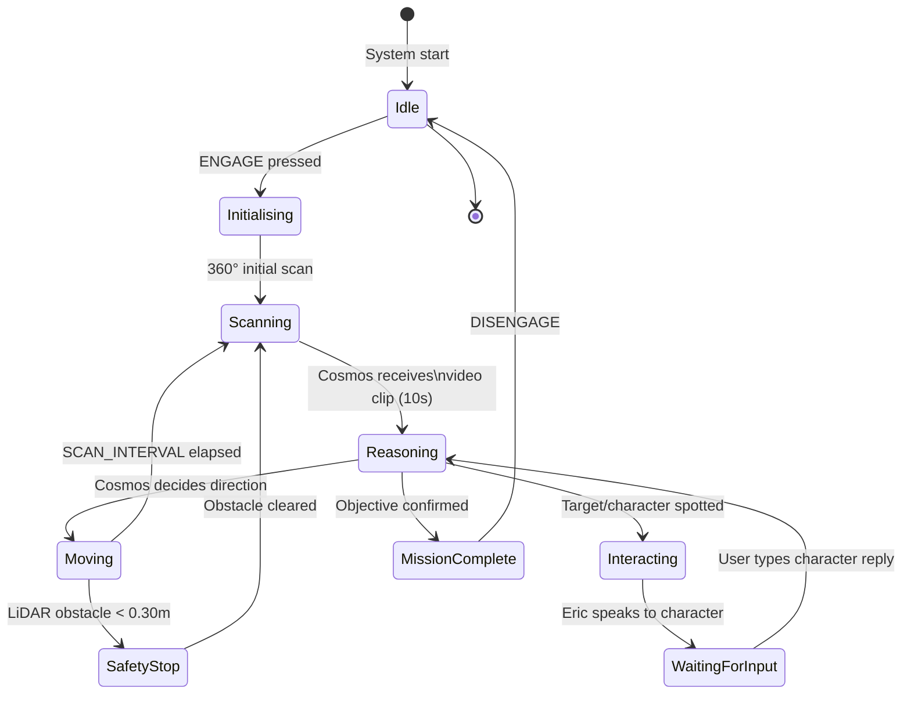
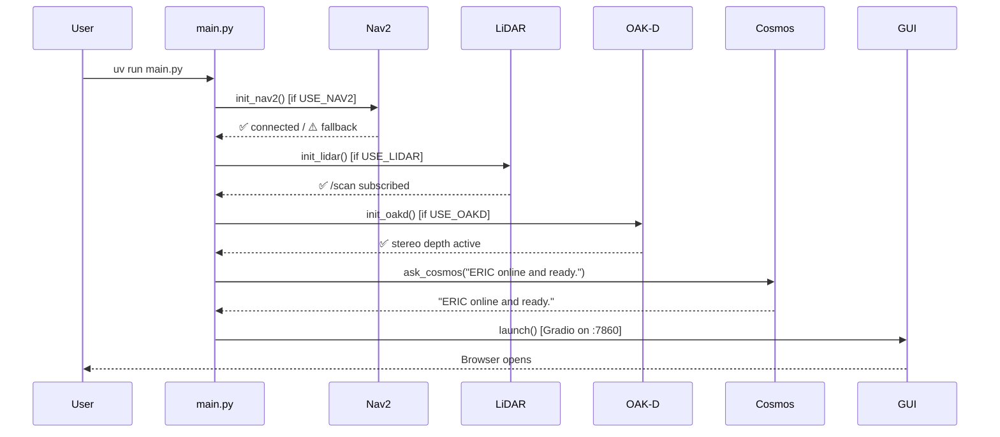
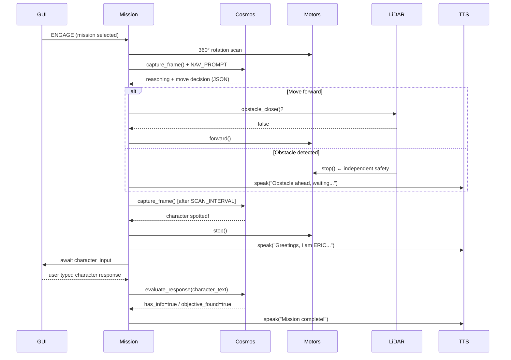

# ERIC — Edge Robotics Innovation by Cosmos

**NVIDIA Cosmos Cookoff 2026 Entry**

ERIC is a search and rescue ground robot powered by NVIDIA Cosmos Reason 2, running fully at the edge on a ~$750 CAD Jetson Orin Nano Super 8GB. No cloud. No server. Just a tracked robot reasoning about the physical world in real time.

Cosmos is the **mission brain** — it sees, reasons, and decides. The D500 LiDAR and OAK-D Lite provide an independent safety layer so Eric never hits walls regardless of what Cosmos is doing. ROS2 Nav2 handles path planning when enabled.

## Demo

**Mission: Find Princess Leia**

Eric navigates a Star Wars Lego scene autonomously — scanning with dual cameras, reasoning with Cosmos about what it sees, talking to characters to gather mission information, and never hitting obstacles thanks to LiDAR safety monitoring. Entire demo recorded from the Gradio GUI screen — no outdoor filming needed. Judges see both live camera feeds, reasoning, motor telemetry, and LiDAR status simultaneously.

## Hardware

| Component | Details |
|---|---|
| SBC | Jetson Orin Nano Super 8GB |
| Robot | Waveshare UGV Beast (tracked) |
| LiDAR | D500 (360°, reactive obstacle safety) |
| Depth Camera | OAK-D Lite (3D perception) |
| Camera 1 | Webcam (close-up scanning) |
| Camera 2 | Pan-tilt wide-angle (navigation + overview) |
| TTS | Piper danny-low (CPU, zero VRAM) |
| Total | ~$750 CAD |
| Location | Vancouver BC, Canada |

## Stack

| Component | Role |
|---|---|
| Cosmos Reason 2 (2B W4A16) via vLLM | Vision + physical reasoning — mission brain |
| ROS2 Humble + Nav2 | Autonomous path planning (optional) |
| D500 LiDAR → ROS2 /scan | Reactive obstacle safety — stops Eric independently |
| OAK-D Lite | Depth perception via DepthAI ROS2 |
| Piper via RealtimeTTS | Streaming TTS, CPU only, zero VRAM |
| Gradio | Dual camera + LiDAR status + mission control UI |
| Waveshare ESP32 serial UART | Motor + OLED + LED + pan-tilt control |

---

## Architecture

### System Overview

```mermaid
flowchart TD
    COSMOS["🧠 COSMOS REASON 2\n(Mission Brain)\nSees → Reasons → Decides"]

    subgraph SENSORS["Sensor Layer"]
        LIDAR["📡 D500 LiDAR\n360° /scan topic"]
        OAKD["📷 OAK-D Lite\nStereo Depth"]
        CAM1["🎥 Webcam\nClose-up"]
        CAM2["🎥 Pan-tilt Cam\nWide angle"]
    end

    subgraph NAV["Navigation Layer"]
        NAV2["🗺️ ROS2 Nav2\nPath Planning + SLAM\n(optional)"]
        DIRECT["⚡ Direct Motor Control\n(fallback)"]
    end

    subgraph SAFETY["⚠️ Independent Safety Layer"]
        LIDAR_MON["LiDAR Safety Monitor\nlidar.py"]
        OAKD_MON["OAK-D Depth Monitor\noakd.py"]
    end

    MOTORS["🤖 ESP32 Motors\nWaveshare UGV Beast UART"]

    CAM1 --> COSMOS
    CAM2 --> COSMOS
    OAKD --> OAKD_MON
    LIDAR --> LIDAR_MON

    COSMOS -->|"goal pose / direction"| NAV2
    COSMOS -->|"fallback: turn/move cmds"| DIRECT

    NAV2 -->|cmd_vel| MOTORS
    DIRECT --> MOTORS

    LIDAR_MON -->|"obstacle < 0.30m → STOP\nobstacle < 0.60m → SLOW"| MOTORS
    OAKD_MON -->|depth data available\nto Cosmos + mission| COSMOS

    style SAFETY fill:#3a1a1a,stroke:#cc4444
    style COSMOS fill:#1a2a3a,stroke:#4488cc
```



### Obstacle Safety Logic

> **Current behaviour:** Eric stops or slows — it does **not** yet automatically reverse or steer around obstacles. Avoidance manoeuvres are on the roadmap.

```mermaid
flowchart LR
    SCAN["D500 /scan\n360° reading"]
    ARC["Extract front arc\n±60° = 120° total"]
    MIN["min_distance\nin front arc"]

    MIN -->|"< 0.30 m"| STOP["🛑 motors.stop()\nHARD STOP"]
    MIN -->|"0.30–0.60 m"| SLOW["🐢 motors.slow()\nREDUCE SPEED"]
    MIN -->|"> 0.60 m"| CLEAR["✅ No action\nCosmos drives"]

    SCAN --> ARC --> MIN

    style STOP fill:#3a0000,stroke:#cc0000
    style SLOW fill:#2a1a00,stroke:#ff6600
    style CLEAR fill:#0a2a0a,stroke:#76b900
```



### Mission State Machine



---

## Sequence Diagrams

### Startup Sequence



### Mission Loop — One Reasoning Cycle



### TTS Pipeline

```mermaid
sequenceDiagram
    participant Mission
    participant speak()
    participant Queue
    participant Worker
    participant Piper
    participant gTTS

    Mission->>speak(): speak("Hello world")
    speak()->>Queue: clear stale items
    speak()->>Queue: put(text)
    speak()-->>Mission: returns instantly (non-blocking)

    loop Background worker
        Worker->>Queue: get(timeout=1s)
        Queue-->>Worker: text

        alt Piper available
            Worker->>Piper: feed(text).play()
            Piper-->>Worker: audio complete (blocking)
        else gTTS fallback
            Worker->>gTTS: gTTS(text)
            gTTS-->>Worker: .mp3 via pygame
        end

        Worker->>Queue: task_done()
    end
```

---

## Project Structure

```
eric/
├── main.py                   # Entry point — initializes Nav2, LiDAR, Cosmos, GUI
├── config.py                 # All configuration (env vars + ROS2 flags)
├── cosmos.py                 # Cosmos Reason 2 API, camera, digital zoom crop
├── motors.py                 # Waveshare serial motor control + OLED + LED
├── tts.py                    # Piper streaming TTS (CPU, zero VRAM)
├── mission.py                # Mission state machine + YAML loader
├── nav2.py                   # ROS2 Nav2 integration (graceful fallback)
├── lidar.py                  # D500 LiDAR safety monitor
├── oakd.py                   # OAK-D Lite stereo depth
├── gui.py                    # Gradio dual-camera + LiDAR status UI
├── missions/
│   ├── template.yaml         # Start here — fully commented
│   ├── star_wars.yaml        # Find Princess Leia
│   ├── anakin_training.yaml  # Eric IS Anakin, faces dark side choice
│   ├── search_rescue.yaml    # Lost hiker rescue
│   └── office_mystery.yaml   # Missing USB drive
├── launch/
│   └── cosmos.sh             # vLLM Docker launch script
├── env.example               # Environment config template
└── pyproject.toml            # uv dependencies
```

## Quick Start

```bash
git clone https://github.com/OppaAi/eric
cd eric
uv sync

cp env.example .env
nano .env   # set SERIAL_PORT, camera indices, Piper paths

# 1. Start Cosmos vLLM (takes ~3 minutes to load)
bash launch/cosmos.sh
docker logs -f vllm-server   # wait for "Application startup complete"

# 2. (Optional) Start ROS2 Nav2 + LiDAR
ros2 launch ugv_tools navigation.launch.py   # Nav2 + SLAM
ros2 launch ugv_tools lidar.launch.py        # D500 LiDAR

# 3. Start Eric
uv run main.py

# 4. Open GUI
http://JETSON_IP:7860
```

## .env Configuration

```bash
# Required
SERIAL_PORT=/dev/ttyTHS1
PIPER_BINARY=/home/oppa-ai/piper/piper
PIPER_MODEL=/home/oppa-ai/piper/voices/en_US-danny-low.onnx

# Camera indices (check with: python3 -c "import cv2; [print(i, cv2.VideoCapture(i).read()[0]) for i in range(4)]")
CAMERA_WEBCAM=2
CAMERA_PANTILT=0

# Optional Nav2 + LiDAR (set true after ros2 launch)
USE_NAV2=false
USE_LIDAR=false
USE_OAKD=false
LIDAR_STOP_DIST=0.30
LIDAR_SLOW_DIST=0.60
```

## GUI

```
┌─────────────────────────────────────────────────────┐
│              🚨 EMERGENCY STOP 🚨                   │
├──────────────────┬──────────────────────────────────┤
│  Pan-tilt feed   │  📋 Mission (dropdown / text)    │
│  (wide angle)    │  [🚀 ENGAGE]  [🛑 DISENGAGE]    │
├──────────────────┤  Status                          │
│  Webcam feed     │  🔊 Eric Says                   │
│  (close-up)      │  💬 Character Interaction        │
├──────────────────┤  🕹️ Manual Controls             │
│  🚗 Telemetry   │  🛠️ Utilities                   │
│  📡 LiDAR       │  📜 Mission Log                  │
└──────────────────┴──────────────────────────────────┘
```

## Wide-Angle Camera & Object Detection

The pan-tilt camera is wide-angle — small objects like Lego figures can be hard for Cosmos to identify. Eric handles this automatically:

1. **Wide scan first** — Cosmos sees full scene context
2. **Digital zoom crop** — if something detected, `capture_zoomed()` crops and zooms that region
3. **Multi-zoom scan** — `multi_zoom_scan()` sends 1 wide + 4 cropped frames in one Cosmos call
4. **Webcam close-up** — when stopped and interacting, webcam gives high-detail close-up view

## Missions

Missions are YAML files in `missions/`. Select from dropdown — Eric's reasoning adapts completely.

| File | Mission |
|---|---|
| `star_wars.yaml` | Find Princess Leia in a Star Wars Lego scene |
| `anakin_training.yaml` | Eric IS Anakin Skywalker, faces the dark side choice |
| `search_rescue.yaml` | Find a missing hiker |
| `office_mystery.yaml` | Locate a missing USB drive |

**Create your own:** copy `missions/template.yaml` — no coding required.

## How a Mission Works

1. Select mission → press **ENGAGE**
2. Eric does initial 360° scan of the area
3. Cosmos analyses video clips while Eric moves (NAV_PROMPT — 10s clips)
4. LiDAR safety monitor runs independently — stops Eric if wall within 30cm
5. Nav2 handles path planning around obstacles (when enabled)
6. Eric stops at characters — type as character in GUI
7. Eric evaluates response, gets info, politely exits if off-topic
8. Mission continues until objective found

## Obstacle Avoidance — Current Behaviour & Roadmap

| Sensor | Current Behaviour | Roadmap |
|---|---|---|
| D500 LiDAR | Stop (< 0.30m) / Slow (< 0.60m) | Reverse + turn away, retry path |
| OAK-D Lite | Depth data exposed to Cosmos | Feed into Nav2 costmap, trigger evasion |
| Cosmos | Can reason about obstacles in frame | Issue reverse/turn commands via mission |

The safety layer is **reactive only** today — it halts Eric but does not steer around obstacles. Full evasion (back up → turn → re-approach) is planned as a `mission.py` recovery behaviour triggered when the LiDAR stop condition persists for > 2 seconds.

## Cosmos Performance (Jetson Orin Nano 8GB)

| Metric | Value |
|---|---|
| Model | `embedl/Cosmos-Reason2-2B-W4A16` |
| TPS | ~16–17 tokens/second |
| Vision inference | ~5–9 seconds per frame |
| GPU utilization | 0.75 |
| Startup time | ~3 minutes |
| VRAM for model | ~2.3 GB |

## Dependencies

```bash
uv add gradio pyyaml pyserial requests python-dotenv \
        opencv-python-headless gtts pygame RealtimeTTS
# ROS2 Nav2 and LiDAR via apt (ros-humble-nav2-*, ros-humble-rplidar-ros)
```

## Built by

Solo developer — Vancouver BC, Canada
Built for the NVIDIA Cosmos Cookoff 2026
https://github.com/OppaAi/eric