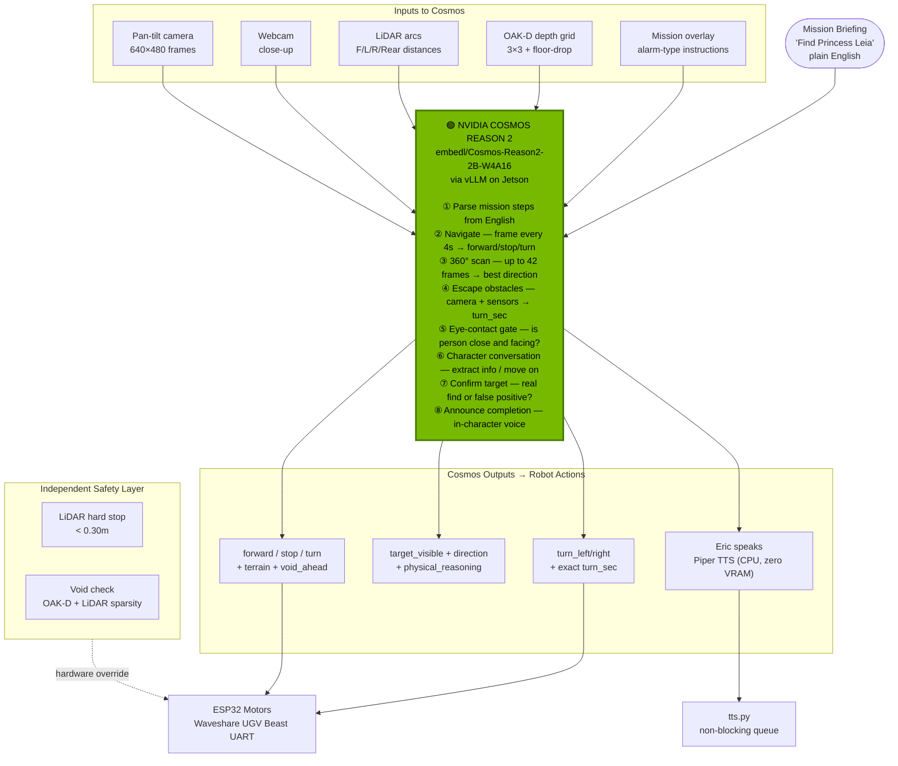

# ERIC — Edge Robotics Innovation by Cosmos

**Autonomous ground robot powered by NVIDIA Cosmos Reason 2**
**Built in 3 days · Jetson Orin Nano Super 8GB · Vancouver BC, Canada**
**Author:** [OppaAI](https://github.com/OppaAI) · **License:** [Apache 2.0](LICENSE)

[](https://github.com/OppaAI/eric)

[](https://opensource.org/licenses/apache-2-0)


---

ERIC is a tracked ground robot that runs **NVIDIA Cosmos Reason 2** fully at the edge — no cloud, no server, not even internet. Give it a mission in plain English, press ENGAGE, and it navigates, reasons, talks to people, avoids obstacles, and announces what it finds — all powered by a single vision-language model on a $250 Jetson.

---

## How Cosmos Powers Everything

Cosmos Reason 2 is not just the object detector. It **is** the robot's brain — every decision Eric makes flows through it.



**Performance on Jetson Orin Nano 8GB:**
- ~16–17 tokens/sec on vision calls
- ~5–9 seconds per reasoning call
- ~6.8 GB VRAM · Zero cloud · Zero network latency

---

## Demo

### Operation Find Leia (Indoor · Multi-Step · Story)

A Star Wars Lego scene. Eric navigates autonomously, questions R2-D2 and Luke for intel, and tracks down Princess Leia.

**What judges see in the recording:**
- Cosmos parsing `"Find R2-D2 → brief Luke → locate Leia"` into 3 sequential steps at startup
- Pan-tilt 360° scan — camera sweeping 7 positions × 3 tilt angles, all frames sent to Cosmos as a batch
- `physical_reasoning` visible live in the Gradio log — judges watch Cosmos think
- Eye-contact gate — Eric only greets a character when Cosmos confirms they're close and facing
- Type as any character in the GUI — Cosmos decides whether to extract info, ask a follow-up, or move on
- 3-layer obstacle avoidance when Eric hits a Lego piece — LiDAR stops, Cosmos picks the escape route
- Mission complete announcement generated by Cosmos in character voice

**Recording:** Screen-record the Gradio GUI — dual cameras, telemetry, reasoning log all in one frame. No outdoor filming needed.

---

### Fetch My Slippers (Simple · Everyday)

One-sentence briefing. Eric scans the room, finds the slippers on the floor, and announces the find. Shows Cosmos reasoning on a totally mundane real-world task with no special props.

---

## Hardware

| Component | Model | Cost (CAD) |
|---|---|---|
| SBC | Jetson Orin Nano Super 8GB | ~$250 |
| Robot | Waveshare UGV Beast (tracked) | ~$350 |
| LiDAR | YDLIDAR D500 360° | ~$80 |
| Depth Camera | OAK-D Lite | ~$80 |
| Webcam | USB | ~$20 |
| **Total** | | **< $800 CAD** |

---

## Software Requirements

- JetPack 6.2.2 (Ubuntu 22.04 · CUDA 12.6)
- Python 3.10+ · `uv` package manager
- Docker (for vLLM Cosmos container)
- ROS2 Humble *(optional — for LiDAR + Nav2)*

```bash
git clone https://github.com/OppaAi/eric
cd eric
uv sync
```

→ See **[Deployment Guide](docs/DEPLOYMENT.md)** for full setup steps.

---

## Quick Start

```bash
# 1. Start Cosmos vLLM (~3 min to load)
bash launch/cosmos.sh
docker logs -f vllm-server   # wait for "Application startup complete"

# 2. Start ERIC
uv run main.py

# 3. Open GUI
http://JETSON_IP:7860
```

Select a mission → press **ENGAGE** → watch Cosmos think.

---

## Docs

| | |
|---|---|
| [How ERIC Uses Cosmos](docs/COSMOS.md) | All 9 roles Cosmos plays, system prompt, mission overlay, JSON examples |
| [Architecture](docs/ARCHITECTURE.md) | System diagram, avoidance pipeline, state machine, key systems |
| [Missions](docs/MISSIONS.md) | Mission library, YAML schema, alarm types, how to write your own |
| [Deployment Guide](docs/DEPLOYMENT.md) | Full step-by-step setup, .env config, troubleshooting |

---

## Built by

Solo developer — Vancouver BC, Canada.
No CS degree. Just curiosity, a Jetson, a tracked robot, and NVIDIA Cosmos Reason 2.
Built in 3 days for the NVIDIA Cosmos Cookoff 2026.

https://github.com/OppaAi/eric
