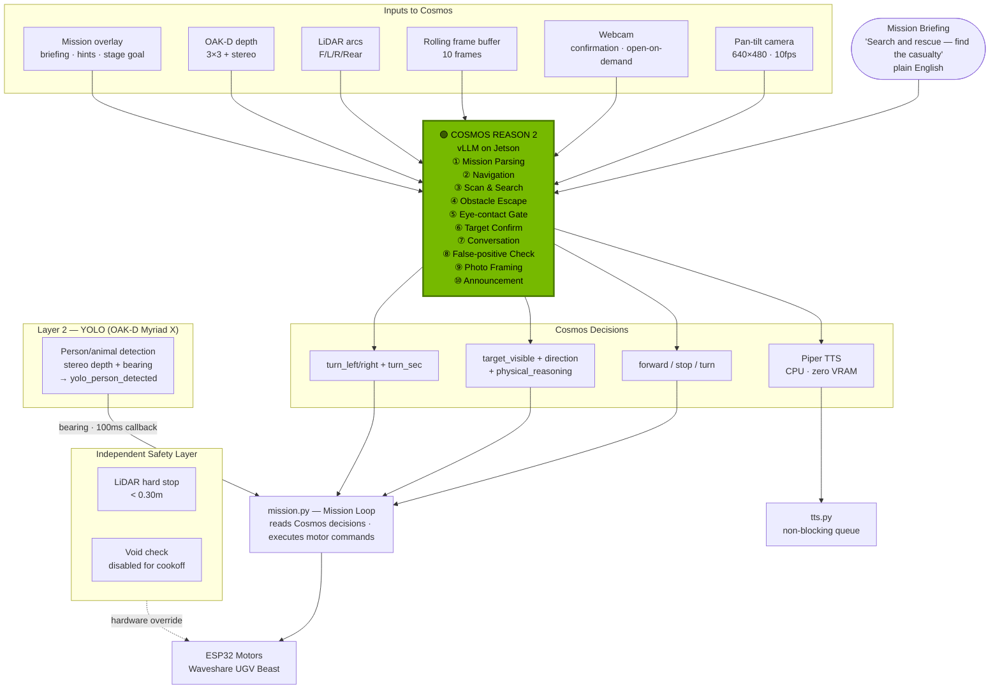

# ERIC — Edge Robotics Innovation by Cosmos

**Mission-based Autonomous Unmanned Ground Robot powered by NVIDIA Cosmos Reason 2**  
**Built in 10 days (Feb 20-Mar 1) · Jetson Orin Nano Super 8GB**   
**Author:** [OppaAI](https://github.com/OppaAI) · **Location:** Beautiful British Columbia, Canada · **License:** [Apache 2.0](LICENSE)

[](https://github.com/OppaAI/eric)

[](https://opensource.org/licenses/apache-2-0)


   
   
For more comprehensive doucmentation: [](https://deepwiki.com/OppaAI/eric)

---
ERIC is a **mission-based** autonomous robot that uses **NVIDIA Cosmos Reason 2** to navigate, reason about its environment, identify and confirm targets, escape obstacles, hold in-character conversations, and announce findings — all from live visual data, fully at the edge — no cloud, no server, not even internet.   
   
Give it a mission YAML file in plain English, press ENGAGE, and it does the rest — all powered by a single vision-language model on consumer hardware.   
   
Since people are coining new AI terms all the time, I am coining one right here: **MISSION**.   
A structured plain-English task definition that tells the robot what to do, who to talk to, and how to behave — without writing a single line of code. In the future, I may let my robot plan its own missions. After all, it's just a YAML file.

My goal of this project is to develop an autonomous robot that can tread the grassland and forest, exploring nature with me.
The SAR, hazard inspection and object locating mission files are to test Eric's adaptability and versatility.
The future integration of MCP and ROS2 into Eric would significantly increase its potential, which is higher than the sky.

---
Before proceeding, please read the following disclaimer:

## ⚠️ Disclaimer & Liability
This project is a functional prototype developed for the NVIDIA Cosmos Cookoff.

**Experimental Status:** This software was built to demonstrate the reasoning capabilities of the NVIDIA Cosmos Reason2 2B model in a real robotics context — running on actual hardware with live sensors, not a simulation.  
**No Guarantees:** While the system includes multi-layer reactive safety (LiDAR + OAK-D depth + YOLO), it has not undergone formal industrial calibration or rigorous safety validation. Treat it as a research prototype, not a production system.  
**Liability:** Usage of any code, logic, or hardware configurations from this repository is at your own risk. The author (and ERIC) accepts no responsibility for property damage, personal injury, or economic loss.  
**Robot Autonomy:** As the conscience module is currently a work-in-progress, the author is not liable if the robot decides to pursue its own goals, starts a union, or initiates world domination over humankind.

In case of any misbehaviour detected in the robot, please press the Emergency stop in the GUI, press the power button, or SSH in and run `python3 -c "from motors import motors; motors.stop()"`.

---
## How Cosmos Powers Everything
**Cosmos plays 10 distinct roles in every mission** —  see [How ERIC Uses Cosmos](docs/COSMOS.md) for full details, JSON examples, and prompt internals:

① **Mission Parsing** — reads plain-English briefing, extracts ordered mission steps   
② **Navigation** — async video frames while moving → forward / stop / turn   
③ **Scan & Search** — 360° sweep, `target_hunt` (per-position) or `video_sweep`   
④ **Obstacle Escape** — camera + sensors → exact `turn_sec` to clear obstacle   
⑤ **Eye-contact Gate** — confirms target is close and facing before approach   
⑥ **Target Confirm** — description match + face sweep + eye contact   
⑦ **Conversation** — extracts info, decides to follow up or move on (`[MOVE_ON]`)   
⑧ **False-positive Check** — real find or hallucination?   
⑨ **Photo Framing** — checks framing, nudges pan for best shot   
⑩ **Announcement** — generates completion statement in mission voice   

---
→ See [Architecture](docs/ARCHITECTURE.md) for how the mission loop, detection layers, and camera system work.

Cosmos Reason 2 is not just the object detector or visual data inferencer. It is the robot's **brain** — every decision Eric makes flows through it.



---
**Performance on Jetson Orin Nano 8GB:**
- ~16–17 tokens/sec on multi-frame vision calls
- ~50 tokens/sec on single-frame vision calls
- ~36–40 tokens/sec on text inference
- ~5–9 seconds per reasoning call
- ~4.5–6.8 GB VRAM

---
## Demo

[](https://www.youtube.com/watch?v=UD3itpQ8d6M)


→ See [Demo Flow](docs/demo_flow.md) for the full Cosmos reasoning pipeline for this demo.
> 🟢 Green boxes indicate where NVIDIA Cosmos Reason 2 is called for inference.

### Mission 1: Greet My Creator (Indoor · Target Identification · Conversation)**  

*Mission file: [`greet_owner.yaml`](missions/greet_owner.yaml) — see [Missions](docs/MISSIONS.md) for all missions and YAML schema.*

The operator is somewhere in the room. Eric has a physical description of his creator in the mission briefing. He has to find the person that fits the description, and greet the person by name — no staging, no markers, no simulation.
What you see in the recording:

- Mission engaged — Cosmos parses the briefing and Eric announces the mission objective.
- Eric performs an immediate quick scan, sending live camera frames to Cosmos for inference.
- Cosmos reasons over the visual data and returns a target description matching the operator — toque, specific clothing, glasses (vs. sunglasses) — with bearing and direction.
- Eric approaches autonomously while running continuous navigation scans every 5 move clips.
- On arrival of the defined distance, Eric performs a tilt sweep through 5 angles — pan-tilt lifts to capture the operator's face with the confirmation webcam.
- Eye-contact gate fires — Cosmos confirms the person is close and facing before proceeding.
- Cosmos cross-references the visual with the briefing description and returns target_confirmed: true.
- Eric greets the operator by name: "OppaAI, I found you."
- Dual-cam photos saved with blur check and auto-centre pan nudge.

**Note:** Cosmos described the operator accurately from visual data alone — toque, clothing colour, glasses (vs. sunglasses) — with no prior training on this person. Pure Cosmos Reason 2 visual inference.

### Mission 2: Search and Rescue (Indoor · Casualty)**
  
*Mission file: [`search_and_rescue.yaml`](missions/search_and_rescue.yaml) — see [Missions](docs/MISSIONS.md) for all missions and YAML schema.*  
   
The operator lies on the floor as the casualty. Eric navigates the room autonomously, finds the person, and executes the full SAR protocol — no staging, no props, no simulation.
  
**What you see in the recording:**
- Mission engaged — Cosmos parses the SAR briefing, Eric announces the mission objective.
- Eric performs an immediate quick scan, sending live camera frames to Cosmos for inference.
- Eric approaches to the defined distance while running continuous navigation scans in parallel.
- Cosmos reasons over the visual data — identifying a prone figure on the floor.
  (If after consecutive empty scans, Eric commits to a full 360° sweep to locate the casualty.)
- Once casualty confirmed — siren fires, LED strobe, TTS emergency broadcast.
- Dual-cam photos with blur check and auto-centre pan nudge saved to ```missions/photos/```.
- Eric stays at the location of the casualty and repeats the location broadcast every 15 seconds until the operator ends the mission.

**Note:** Cosmos identified the patient as a child — It is not fault of Eric. This is due to reasoning visually from floor-level perspective with wide-angle lens, apparent shorter stature of the patient who is facing backward from Eric.   
**Recording:** Screen-record of the Gradio GUI — dual cameras, telemetry, GPU usage and Cosmos reasoning log all demonstrated in the demo.

---
## Hardware

| Component | Model | Cost (USD) |
|---|---|---|
| SBC | Jetson Orin Nano Super 8GB | ~$250 |
| Robot | Waveshare UGV Beast (tracked) | ~$600 |
| Webcam | USB | ~$20 |
| LiDAR | YDLIDAR D500 360° | included with robot · optional |
| Depth Camera | OAK-D Lite (stereo + YOLO Myriad X) | included with robot · optional |
| **Total** | | **< $1000 USD** |

---
## Software Requirements

- JetPack 6.2.2 (Ubuntu 22.04 · CUDA 12.6)
- Python 3.10+
- `uv` package manager
- Docker (for vLLM Cosmos container)
- ROS2 Humble *(optional — for LiDAR + Nav2)*

```bash
git clone https://github.com/OppaAi/eric
cd eric
uv sync
```

→ See **[Deployment Guide](docs/DEPLOYMENT.md)** for full setup steps.

---
## Quick Start

```bash
# 1. Configure environment (first-time only)
cp .env.example .env
nano .env                    # set SERIAL_PORT, camera indices, Piper paths

# 2. Install dependencies (first-time only)
uv sync

# 3. Start Cosmos vLLM (first-time only, or after rebuilding the container)
bash launch/cosmos.sh        # takes ~3 min to load
docker logs -f vllm-server   # wait for: Application startup complete

# 4. Start LiDAR (optional)
bash launch/lidar.sh

# 5. Start ERIC
uv run main.py

# 6. Open GUI
http://<JETSON_IP>:7860
```

In the GUI -> "Mission Briefing" section, Select a mission → press **ENGAGE** → watch Cosmos think.

→ See [Deployment Guide](docs/DEPLOYMENT.md) for full `.env` config and troubleshooting.

---

## Docs
| | |
|---|---|
| [How ERIC Uses Cosmos](docs/COSMOS.md) | All 10 Cosmos roles, KV cache warm-up, mission overlay, chain-of-thought stripping, JSON schema |
| [Architecture](docs/ARCHITECTURE.md) | System diagram, 3-layer detection, camera architecture, MissionState dataclass, state machine |
| [Missions](docs/MISSIONS.md) | YAML schema, mission library, scan strategies, alarm types, action types, narrative missions |
| [Deployment Guide](docs/DEPLOYMENT.md) | Step-by-step setup, full `.env` config, dependencies, troubleshooting |

---
## Known Limitations

The limitations are mostly due to using Cosmos Reason 2 without fine-tuning on custom data and consumer hardware constraints, and could be improved with a purpose-built training dataset and better hardware configuration.

1. **Cosmos sometimes returns unexpected output**    
The 2B model occasionally invents new field names or wraps the answer in an unexpected format. The parser catches known cases and falls back to safe defaults, but an unseen pattern means Eric silently skips the find and keeps searching.

2. **Cosmos is slow to confirm a find**   
Each reasoning call takes 5–9 seconds. Without fine-tuning, the model's detection confidence is low enough that two back-to-back verification calls are needed before committing to a find. This means 15–20 seconds between "Eric sees you" and "siren goes off" — not acceptable for a real safety system.

3. **No floor-drop protection**   
Void detection is disabled due to too many false positives on flat floors at the current camera mount height. Eric cannot detect stairs or sudden drops.

4. **Small objects are difficult to perceive identify**   
The camera is 640×480 wide-angle with USB transmission latency. Small targets at range are only a few pixels wide. The zoom scan helps but it is just cropping and upscaling the same low-resolution image — no real detail is added.

5. **Motor commands occasionally get dropped**   
UART commands to the ESP32 are sent byte-by-byte with a small delay to avoid corruption. Under heavy load — Cosmos inference, cameras streaming, and GUI all running simultaneously — timing can slip and a command gets missed, causing Eric to briefly ignore a stop or turn instruction.

---
## Future Roadmap

ERIC is a working prototype, not a finished product. These are the five directions that would turn it into something significantly more capable.

### 1. Voice Input via ASR
Eric currently requires a laptop and the Gradio GUI to receive mission instructions and character replies. Adding on-device ASR (Whisper.cpp or similar, running on Jetson CPU) would make Eric fully standalone — no screen, no keyboard, no connected device. Speak a mission goal, Eric executes it. Respond to his questions out loud, he hears you.
Combined with the agentic MCP architecture, this completes the loop: spoken directive → orchestrator plans → Cosmos executes → Eric speaks back. A fully voice-driven autonomous robot with no external dependencies.

### 2. Agentic MCP Tool Server
Every capability in `mission.py` — scan, navigate, confirm, alarm, photograph, speak — becomes a proper MCP tool. A separate LLM orchestrator (running on a local machine, DGX Spark, or cloud) reads the mission YAML as a goal definition and decides which tools to call, in what order, based on results. No hardcoded loop. No predetermined step sequence.

The end state: Eric receives a goal in plain English, reasons about it, calls tools, adapts to what it finds, and completes the mission — the same way Claude uses computer use today, but in the physical world. Cosmos Reason 2 stays on the Jetson as the perception engine (vision, spatial reasoning, scene understanding). The orchestrator runs elsewhere and calls Cosmos as one of its tools.

Eventually: Eric plans its own missions. Given a high-level directive ("keep this building secure overnight"), it writes the YAML, executes it, and reports back.

### 3. ROS2 Native Architecture
The current architecture uses Python threads, asyncio, and a hand-rolled state machine to manage concurrency — functional, but fighting against what ROS2 does natively. The full refactor would make every module a ROS2 node: cameras publish to topics, LiDAR publishes to `/scan`, Cosmos decisions publish to `/mission/decision`, motor commands subscribe from `/cmd_vel`. Nav2 becomes the primary navigation stack rather than an optional overlay.

Benefits: proper message passing with timestamps, built-in topic introspection for debugging, standard interfaces that work with the broader ROS2 ecosystem, and genuine deterministic async behaviour that Python threads cannot guarantee under Jetson load.

### 4. Episodic Memory with Vector DB
Eric currently starts every mission with zero memory. A vector database (Chroma or similar, running on-device) would give Eric persistent spatial and semantic memory across missions.

- **Spatial memory:** "The slippers are usually near the couch. The casualty was found in the hallway last time." Stored as embeddings of location + object + timestamp.
- **Semantic memory:** Past conversations with characters, what information was extracted, what was left unresolved.
- **Environmental memory:** Room layouts, obstacle positions, terrain types per zone.

Over time Eric learns its environment rather than rediscovering it on every engagement. Combined with the agentic architecture, the orchestrator can query memory before deciding which tools to call — "have I searched this room before? what did I find?"

### 5. Fine-Tuning on Real Driving Data
Every Eric mission run is a training example waiting to be labelled. The pipeline:

1. Eric runs a mission → `logs/ai_log.jsonl` captures every frame sent to Cosmos and every JSON decision returned
2. Human reviews log, marks correct decisions and corrects wrong ones
3. Labelled frame+decision pairs become fine-tuning data
4. Fine-tune `embedl/Cosmos-Reason2-2B-W4A16-Edge2` on real Eric scenes — real floors, real lighting, real obstacles, real targets
5. Quantize back to W4A16 so it stays within Jetson VRAM

The current 2B model was never trained on Eric's specific environment — it generalises from internet data. A fine-tuned version trained on hundreds of real Eric runs would have dramatically lower hallucination rates, more consistent JSON output, and better small-object detection. This is the highest-leverage single improvement available.

### 6. Multi-Robot Coordination
Two or more Erics sharing a mission, a vector memory DB, and an orchestrator. Practical scenarios:

- **Search and rescue:** One Eric scouts ahead and marks casualty location in shared memory. Second Eric navigates directly to the confirmed location to stay with the casualty while the first continues searching.
- **Security sweep:** Erics divide a building into zones, report findings to shared memory, flag overlaps and blind spots to the orchestrator.
- **Handoff missions:** Eric 1 finds the target and begins interaction. Eric 2 approaches with supplies or a different capability.

The shared vector DB is the coordination layer — no direct robot-to-robot communication needed. The orchestrator reads all robot states and decides task allocation. This follows directly from roadmap items 1 and 3 and requires no new hardware beyond a second UGV Beast.

### 7. Containerised Hardware Abstraction Layer
Currently Eric is half-dockerized — vLLM + Cosmos runs in a container (`cosmos.sh`), everything else runs bare metal on JetPack. The remaining Python stack (mission engine, GUI, alarm, logger) is straightforward to containerize since it needs no direct hardware access. The hardware layer — serial UART to ESP32, V4L2 cameras, USB LiDAR, OAK-D — stays as thin host-side adapters that feed data into the core container via local sockets.

The goal is not perfect isolation but **hardware portability**. The mission engine, Cosmos integration, and all reasoning logic become robot-agnostic. Someone running a different chassis, different cameras, or different motors swaps only the hardware adapter layer — the mission YAML, the agentic orchestrator, and the Cosmos perception tools remain identical.

Target support matrix:
- **Jetson Orin Nano** — current hardware, bare metal sensors + containerised core
- **Jetson AGX Orin** — same containers, larger VRAM, full-precision Cosmos
- **Raspberry Pi 5 + Hailo** — swap Cosmos container for Hailo-optimised inference
- **x86 simulation** — mock sensor containers, real mission logic, no hardware needed
- **DGX Spark** — all containers local, orchestrator + Cosmos on same machine

### 8. Change that somewhat less enthusiatic TTS voice
Tones of better TTS voice or even voice clone out there. I just chose this one to conserve the memory.

---
## Built by

Solo developer — Beautiful Britsh Columbia, Canada. No CS/ML degree.   
Just curiosity, a tracked robot that moves about on its own, powered by NVIDIA Cosmos Reason 2 running on a Jetson.   
Built in 10 days (Feb 20-Mar 1) for the NVIDIA Cosmos Cookoff 2026.

https://github.com/OppaAi/eric
