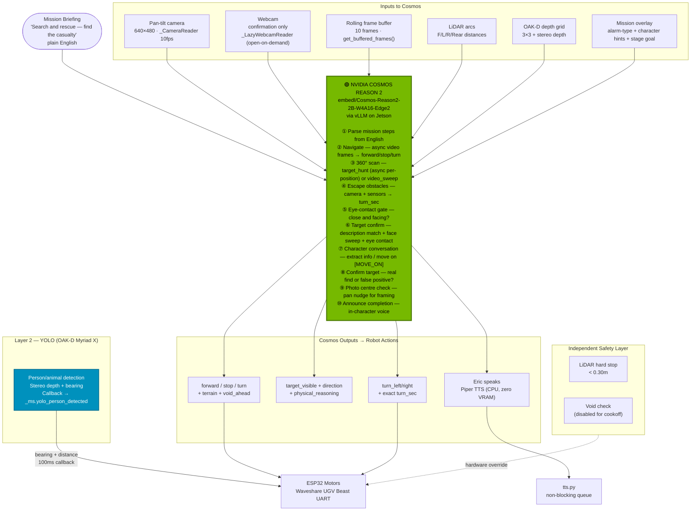

# ERIC — Edge Robotics Innovation by Cosmos

**Mission-based Autonomous Unmanned Ground Robot powered by NVIDIA Cosmos Reason 2**
**Built in 10 days (Feb 20-Mar 1) · Jetson Orin Nano Super 8GB · Vancouver BC, Canada**
**Author:** [OppaAI](https://github.com/OppaAI) · **License:** [Apache 2.0](LICENSE)

[](https://github.com/OppaAI/eric)

[](https://opensource.org/licenses/apache-2-0)


---

ERIC is a tracked ground robot that runs **NVIDIA Cosmos Reason 2** fully at the edge — no cloud, no server, not even internet.  
Since people are coming AI terms everyday,
I am coining a new term today - **MISSION**. 
 
ERIC is a **mission-based** AI Autonomous Robot. Give it a mission yaml file in plain English, press ENGAGE, and it navigates, reasons, talks to people, avoids obstacles, and announces what it finds — all powered by a single vision-language model on consumer hardware.  
In the future, I may program the robot to plan its own mission. After all, it's just a yaml file.

---
Before proceeding, please read the following disclaimer:

# ⚠️ Disclaimer & Liability
This project is a functional prototype developed for the NVIDIA Cosmos Cookoff.

**Experimental Status:** This software was built to demonstrate the reasoning capabilities of the NVIDIA Cosmos Reason2 2B model in a real robotics context — running on actual hardware with live sensors, not a simulation.  
**No Guarantees:** While the system includes multi-layer reactive safety (LiDAR + OAK-D depth + YOLO), it has not undergone formal industrial calibration or rigorous safety validation. Treat it as a research prototype, not a production system.  
**Liability:** Usage of any code, logic, or hardware configurations from this repository is at your own risk. The author (and ERIC) accepts no responsibility for property damage, personal injury, or economic loss.  
**Robot Autonomy:** As the conscience module is currently a work-in-progress, the author is not liable if the robot decides to pursue its own goals, starts a union, or initiates world domination over humankind.

In case of any misbehaviour detected in the robot, please press the Emergency stop in the GUI, press the power button, or SSH in and run `python3 -c "from motors import motors; motors.stop()"`.

---

## How Cosmos Powers Everything

→ SSee [Architecture](docs/ARCHITECTURE.md) for how the mission loop, detection layers, and camera system work.

Cosmos Reason 2 is not just the object detector. It **is** the robot's brain — every decision Eric makes flows through it.



**Performance on Jetson Orin Nano 8GB:**
- ~16–17 tokens/sec on vision calls
- ~5–9 seconds per reasoning call
- ~6.8 GB VRAM · Zero cloud · Zero network latency
---

**Cosmos plays 10 distinct roles in every mission** —  see [How ERIC Uses Cosmos](docs/COSMOS.md) for full details, JSON examples, and prompt internals:

① **Mission Parsing** — reads plain-English briefing, extracts ordered mission steps  
② **Navigation Reasoning/Decision** — async video frames while moving → forward / stop / turn  
③ **Target Scan/Search** — 360° sweep, `target_hunt` (async per-position) or `video_sweep`  
④ **Obstacle Avoidance** — camera + sensors → exact `turn_sec` to clear obstacle  
⑤ **Eye-contact Gate** — confirms target is close and facing camera before approach  
⑥ **Target Identification** — description match + face sweep + eye contact check  
⑦ **Human Interraction** — extracts info, decides to follow up or move on (`[MOVE_ON]`)  
⑧ **Candidate Confirmation** — real find or hallucination?  
⑨ **Photo Check** — checks framing, nudges pan for best shot  
⑩ **Announcement** — generates completion statement in mission voice  

---

## Demo

### Search and Rescue Demo (Indoor · Real Casualty)

*Mission file: [`search_and_rescue.yaml`](missions/search_and_rescue.yaml) — see [Missions](docs/MISSIONS.md) for all missions and YAML schema.*

The operator lies on the floor as the casualty. Eric navigates the room autonomously, finds the person, and executes the full SAR protocol — no staging, no props, no simulation.

**What you see in the recording:**
- After mission is engaged, Cosmos Reason 2 parses the mission prompt, and Eric announces what mission briefting.
- Eric initiates an immediate quick scan of the environment with wide-angle cam and sends the visual data to Cosmos for inference.
- On visual identification of victim, Eric captures a few frames with normal focal length webcam towards the angle the victim was first noticed.
- Based on the captured frames of the victim, Cosmos Reason 2 chose the one with the least blurriness and victim centred in the frame. Then Cosmos use this frame to conduct candidate verification to confirm it is indeed a victim. (Due to 2B model is prone to hallucination, the detection confidence has been significantly to reduce false positive. This is where model training and fine-tuning is critical.)
- Without confirmation, Eric approaches victim step by step while conducting navigation scan with 5 move clips at the same time.
- After 5 consecutive empty scans, Eric tries to circumnavigate the obstacle before committing to a full 360 scan.
- Once Casualty confirmed — siren fires, red LED strobe, TTS emergency broadcast.
- Dual-cam photos with blur check and auto-centre pan nudge saved to missions/photos/ directory (Will need to notify emergency assistance in real situation.)
- Eric stays beside the casualty and repeats the location broadcast every 15 seconds until the operator ends the mission.

**Recording:** Screen-record the Gradio GUI — dual cameras, telemetry, and reasoning log all in one frame. 
**Note:** Due to YOLO (OAK-D Myriad X) is also not trained on person lying on the floor, this demo is mostly based on Cosmos Reason 2

---

## Hardware

| Component | Model | Cost (USD) |
|---|---|---|
| SBC | Jetson Orin Nano Super 8GB | ~$250 |
| Robot | Waveshare UGV Beast (tracked) | ~$600 |
| LiDAR | YDLIDAR D500 360° | Included with Robot |
| Depth Camera | OAK-D Lite (stereo + YOLO Myriad X) | Included with Robot |
| Webcam | USB | ~$20 (Old one lying around) |
| **Total** | | **< $1000 USD** |

---

## Software Requirements

- JetPack 6.2.2 (Ubuntu 22.04 · CUDA 12.6)
- Python 3.10+ · `uv` package manager
- Docker (for vLLM Cosmos container)
- ROS2 Humble *(optional — for LiDAR + Nav2)*

```bash
git clone https://github.com/OppaAi/eric
cd eric
uv sync
```

→ See **[Deployment Guide](docs/DEPLOYMENT.md)** for full setup steps.

---

## Quick Start

```bash
# 1. Start Cosmos vLLM (~3 min to load)
bash launch/cosmos.sh
docker logs -f vllm-server   # wait for "Application startup complete"

# 2. Start ERIC
uv run main.py

# 3. Open GUI
http://JETSON_IP:7860
```

Select a mission → press **ENGAGE** → watch Cosmos think.

---

## Docs

| | |
|---|---|
| [How ERIC Uses Cosmos](docs/COSMOS.md) | All 10 roles Cosmos plays, KV warm-up, chain-of-thought stripping, JSON examples |
| [Architecture](docs/ARCHITECTURE.md) | System diagram, 3-layer detection, MissionState dataclass, camera architecture, state machine |
| [Missions](docs/MISSIONS.md) | Mission library, YAML schema, scan strategies, narrative missions, alarm types |
| [Deployment Guide](docs/DEPLOYMENT.md) | Full step-by-step setup, .env config, troubleshooting |

---

## Built by

Solo developer — Vancouver BC, Canada.
No CS degree. Just curiosity, a Jetson, a tracked robot, and NVIDIA Cosmos Reason 2.
Built in 10 days for the NVIDIA Cosmos Cookoff 2026.

https://github.com/OppaAi/eric
