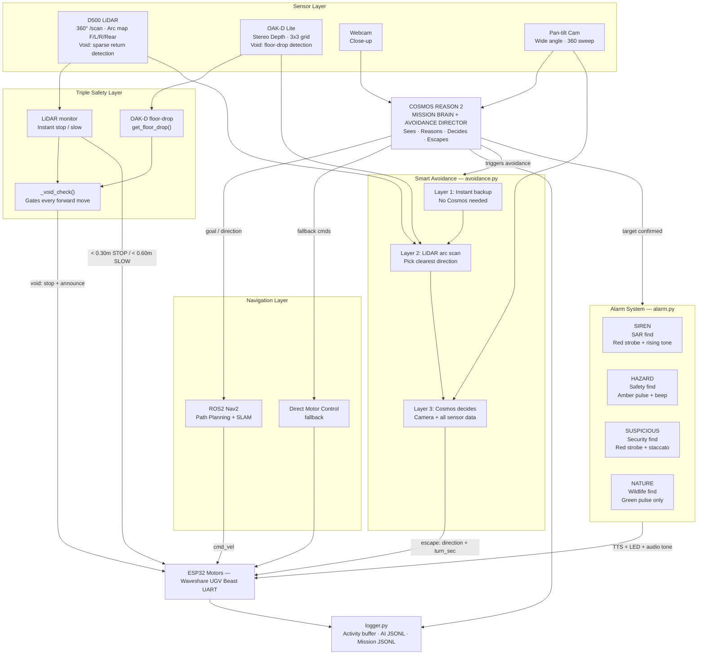
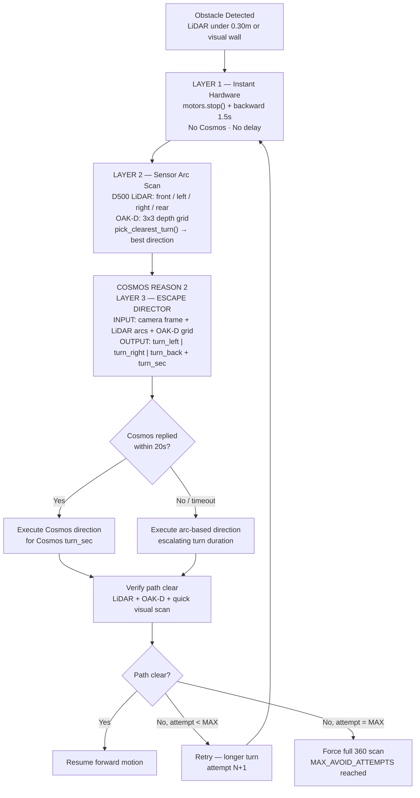
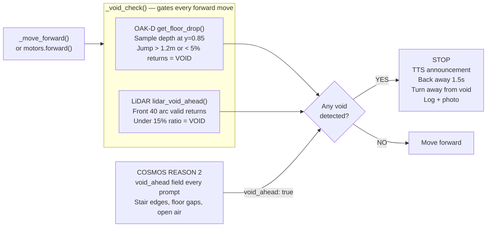
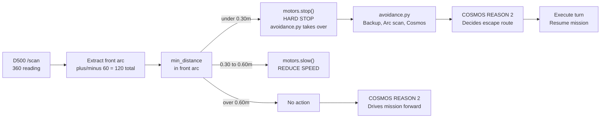
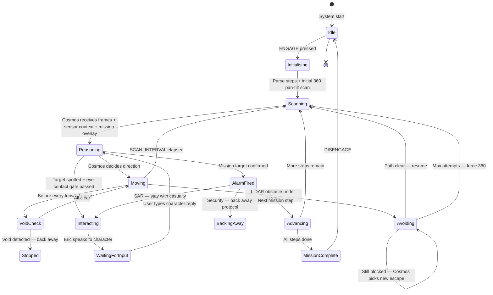
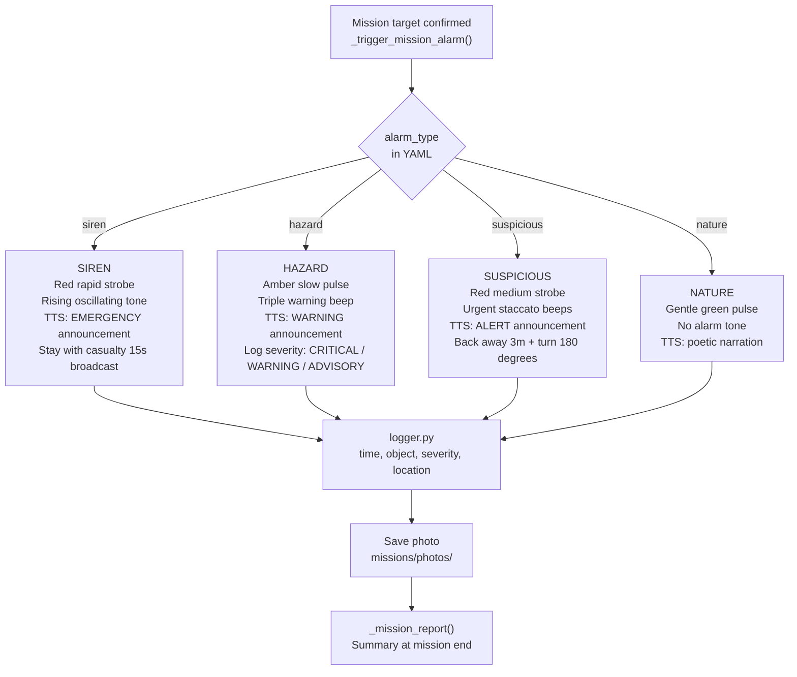
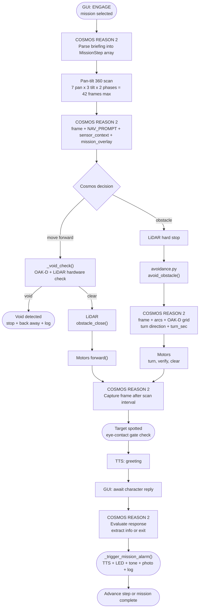
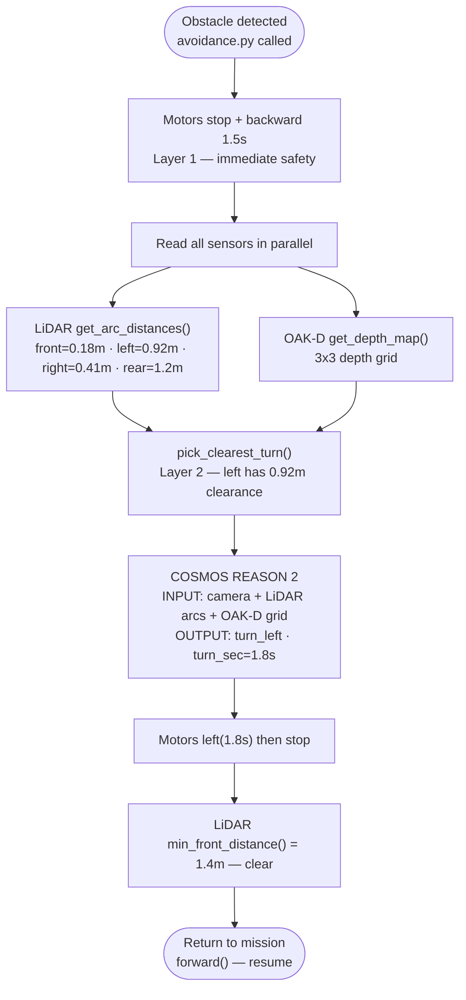
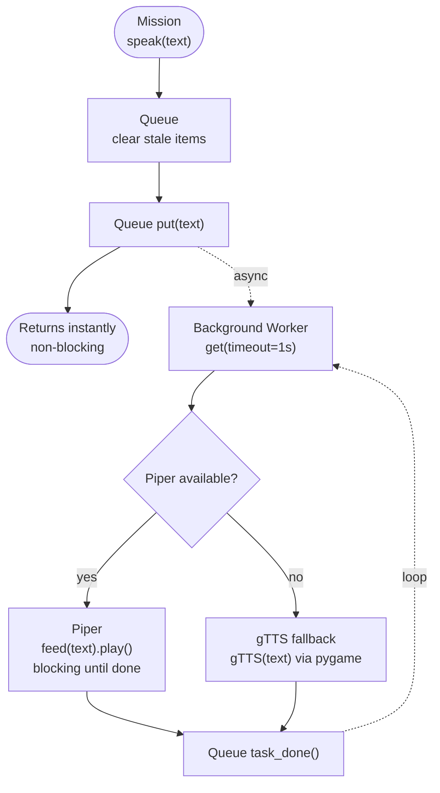

# ERIC — Edge Robotics Innovation by Cosmos

**A tracked-wheel robot on a mission, powered by NVIDIA Cosmos Reason 2**
**Built from Feb 20, 2026 on Jetson Orin Nano Super 8GB**
**Author:** [OppaAI](https://github.com/OppaAI) · **License:** [Apache 2.0](LICENSE)

[](https://github.com/OppaAI/eric)


[](https://opensource.org/licenses/apache-2-0)


---

**AI Robotics Project, powered by NVIDIA Cosmos Reason 2**

ERIC is an autonomous multi-mission ground robot powered by **NVIDIA Cosmos Reason 2**, running fully in the edge device (Jetson Orin Nano Super 8GB).
No cloud. No server. Not even Internet. Only need a local network to communicate to ERIC with your portal device or PC.
ERIC utilizes NVIDIA Cosmos Reason 2Just a tracked robot reasoning about the physical world in real time — navigating, talking to people, detecting hazards, sounding alarms, and documenting what it finds.
- Parses the mission briefing into an ordered list of steps at startup
- Navigates while moving — receives a pan-tilt camera frame every 4 seconds alongside LiDAR distances, OAK-D depth grid, current terrain, and void warnings; outputs a JSON decision (forward, stop, direction, terrain, reasoning)
- Analyses the full 360° panoramic scan — up to 42 frames (7 pan positions × 3 tilt angles × 2 phases) sent as a multi-image batch; outputs best direction, what it sees, void flags per direction
- Directs obstacle escape (Layer 3 of 3) — after instant backup and LiDAR arc scan, receives camera frame + all sensor data and outputs exact escape direction and turn duration in seconds; 20s timeout falls back to sensor-only direction
Mission scan overlay — different alarm types (siren, suspicious, nature) inject mission-specific visual instructions into every scan prompt; changes what Cosmos pays attention to with zero code changes
Character conversation — receives full conversation history + briefing after every character reply; decides whether to extract info, ask a follow-up, or exit politely
Target confirmation — a final check before any alarm fires; filters false positives from shadows and partial views before triggering TTS + LED + tone
Void detection (visual layer) — instructed to examine the lower third of every frame for stair edges, floor texture endings, and open air; third layer on top of OAK-D hardware and LiDAR return sparsity
Mission completion announcement — generates the final in-character summary in the voice and context of the specific mission that just ran
Terrain-speed reasoning — reports terrain type in every scan result; Eric maps it to motor speed automatically (57 terrain keywords, 4 tiers from fast to impassable)

---

## Table of Contents

- [How ERIC Uses NVIDIA Cosmos Reason 2](#how-eric-uses-nvidia-cosmos-reason-2)
- [Demo](#demo)
- [Hardware](#hardware)
- [Software Stack](#software-stack)
- [Cost](#cost)
- [Architecture](#architecture)
- [Project Structure](#project-structure)
- [Deployment Guide](#deployment-guide)
- [Mission System](#mission-system)
- [Mission Library](#mission-library)
- [How a Mission Works](#how-a-mission-works)
- [Key Systems](#key-systems)
- [Performance](#performance)
- [Sequence Diagrams](#sequence-diagrams)

---

### The Model

ERIC runs `embedl/Cosmos-Reason2-2B-W4A16` — a 4-bit weight, 16-bit activation quantized version of Cosmos Reason 2 2B — via vLLM on the Jetson Orin Nano Super 8GB. This quantization is what makes it possible to run a frontier vision-language model fully at the edge on an 8GB device.

- ~40–50 tokens/sec on text
- ~16–17 tokens/sec on 640×480 images
- ~5–9 seconds per vision reasoning call
- ~6.8 GB VRAM utilized
- Zero cloud, zero latency spikes from network

### The System Prompt

Every Cosmos call carries the mission briefing as a persistent system prompt. When you select `find_leia.yaml` and press ENGAGE, the briefing text becomes Cosmos's identity and purpose for the entire mission — it is prepended to every single call. Cosmos does not "remember" previous calls; instead, the system prompt provides continuity:

```python
system_prompt = BASE_IDENTITY + "\n\nMission briefing:\n" + mission_briefing
```

This means every nav check, every scan, every character interaction, every obstacle decision is made with full mission context. Eric never "forgets" what it is doing.

### The Mission Overlay

On top of the system prompt, `_get_mission_scan_overlay()` injects mission-type-specific instructions into every Cosmos scan prompt. If the alarm type is `siren`, Cosmos is told to look for injured people and rate severity as CRITICAL. If it is `suspicious`, Cosmos is given a precise description of what suspicious objects look like and told not to approach. This overlay changes Cosmos's visual attention per mission without any code changes.

### Role 1: Navigation Brain

While moving, Cosmos receives a pan-tilt camera frame every 4 seconds alongside a sensor context block — LiDAR arc distances, OAK-D depth grid, current terrain, void warnings. It outputs a structured JSON decision:

```json
{
  "action": "forward",
  "wall_ahead": false,
  "void_ahead": false,
  "object": "person",
  "target_visible": false,
  "distance": "far",
  "terrain": "carpet",
  "physical_reasoning": "Path is clear ahead. Carpet visible — reducing speed."
}
```

The mission loop reads this JSON and acts on it — no hardcoded routes, no waypoints. Where Eric goes next is always a Cosmos decision.

### Role 2: Mission Step Parser

When a mission starts, Cosmos reads the raw briefing text and parses it into an ordered list of `MissionStep` objects — it extracts targets, sequencing, and action types from natural language:

```
"First find R2-D2 and speak to him. Then find Luke and wait for his response."

→ [MissionStep(target="R2-D2", action="speak_to"),
   MissionStep(target="Luke",   action="wait_for_response")]
```

Eric then executes these steps in order, advancing when each one is complete. No structured mission file required — Cosmos reads English.

### Role 3: 360° Scan Analyst

When Eric stops for a full scan, the pan-tilt head sweeps through 7 pan positions at 3 tilt angles (30° down, 10° down, −10° horizon) — up to 42 frames. These are batched and sent to Cosmos as a multi-image reasoning task. Cosmos analyses the entire panorama and outputs:

- Best direction to move toward the mission target
- Whether a target is visible and where
- Terrain type in each direction and recommended speed
- Void or drop hazards by direction
- Physical reasoning explaining the decision

### Role 4: Escape Director

When the 3-layer avoidance pipeline fires, Cosmos is Layer 3. It receives a camera frame plus LiDAR arc distances (front / left / right / rear) and the OAK-D 3×3 depth grid, and it outputs a specific escape direction with an exact turn duration in seconds:

```json
{"action": "turn_left", "turn_sec": 1.8,
 "physical_reasoning": "Left arc has 0.92m clearance vs 0.18m front and 0.41m right"}
```

Layers 1 and 2 (instant backup + sensor-based direction pick) provide immediate safety. Cosmos provides the intelligent, context-aware escape route. If Cosmos times out (20s limit), the arc-based direction runs instead — Eric is never stuck waiting.

### Role 5: Eye-Contact Gate

Before Eric greets any person it detects, it fires a rapid single-frame Cosmos check asking only one question:

```json
{"close_and_facing": true, "reasoning": "Person is approximately 1m away, face visible and oriented toward camera"}
```

If `close_and_facing` is false — the person is far away, has their back turned, or is not looking — Eric moves on silently. This eliminates greetings shouted across rooms and makes interactions feel natural.

### Role 6: Character Conversation Handler

When a person or character responds in the GUI, Cosmos receives the full conversation history and the mission briefing. It decides:
- Did this person give useful mission information? Extract it.
- Has this conversation run its course? Exit politely and resume the mission.
- Should Eric ask a follow-up question?

### Role 7: Target Confirmation

When Eric believes it has found its mission target, a final Cosmos check confirms: is this genuinely the target from the briefing, or a false positive? Only after confirmation does `_trigger_mission_alarm()` fire — preventing false alarms from shadows or partial views.

### Role 8: Void Detection (Visual Layer)

Every scan prompt includes a `void_ahead` field. Cosmos is instructed to look at the lower third of every frame for stair edges, floor-texture endings, and open-air gaps. This is the third layer of void detection — OAK-D floor-drop (hardware), LiDAR return sparsity (hardware), and Cosmos vision (AI).

### Role 9: Mission Completion Announcement

When all steps are done, Cosmos generates the final triumphant announcement — in character, in voice, in the context of the specific mission that just ran. A search and rescue completion sounds different from a nature explorer summary or a security sweep report.

### Summary Table

| When | What Cosmos receives | What Cosmos outputs |
|---|---|---|
| Mission start | Raw briefing text | Ordered `MissionStep[]` array |
| While moving (every 4s) | Camera frame + sensor context + mission overlay | `forward/stop` + `void_ahead` + terrain + reasoning |
| Full 360° scan | Up to 42 frames + sensor context + mission overlay | Direction + target info + void flags |
| Obstacle hit | Camera + LiDAR arcs + OAK-D grid | Escape direction + `turn_sec` |
| Eye-contact check | Single close frame | `close_and_facing: true/false` |
| Character reply | Conversation history + briefing | Continue / extract info / exit |
| Target spotted | Scene frame + mission context | `target_visible: true/false` + severity |
| Mission complete | All steps confirmed | Final announcement in character voice |

---

## Demo

Two missions recommended — one fully indoor, one optionally outdoor. Both can be recorded entirely from the Gradio GUI screen. No special filming setup needed.

---

### Demo 1 — Operation Find Leia (Indoor · Story · Multi-Step)

**Setup:** A Star Wars Lego scene on a table or floor. Place R2-D2, Luke, C-3PO, Vader, and Leia figures in different locations around the space. Eric navigates the scene, gathers intel, and finds Leia.

**What it shows:**
- Multi-step mission engine (3 sequential goals — find R2, brief Luke, locate Leia)
- Cosmos parsing natural language briefing into sequential steps at startup
- Pan-tilt 360° scan — watch the camera sweep 7 positions at 3 tilt angles
- Eye-contact gate — Eric only greets characters when close and facing
- Character conversations — type as R2, Luke, Leia in the GUI
- 3-layer obstacle avoidance when Eric hits a Lego set piece
- Dual camera feeds, sensor status, motor telemetry all live in GUI
- `physical_reasoning` text visible in the system log — judges see Cosmos thinking

**Recording tip:** Screen-record the full Gradio GUI. Split the recording into: (1) startup + 360° scan, (2) first character encounter, (3) obstacle hit and escape, (4) mission complete.

**No outdoor filming needed.** Entire demo runs in any indoor room.

---

### Demo 2 — Nature Explorer (Outdoor · Optional · Narration)

**Setup:** Any garden, balcony, or outdoor area with grass, plants, or flowers. No props required — the real world is the mission.

**What it shows:**
- Cosmos visual reasoning on uncontrolled real-world scenes
- Colour detection — yellow flowers on green grass, textured bark
- Poetic narration in TTS — nature documentary voice
- Terrain-based speed control — Eric slows on grass, faster on paths
- Gentle green LED pulse on each find (non-alarming contrast to SAR siren)
- Void detection on outdoor surfaces — Eric stops at drops, curbs, steps
- TILT_STEEP 30° camera angle scanning ground surface for small objects

**Recording tip:** Prop the camera or phone over the Gradio GUI on a laptop. Eric roams on its own. One genuine wildlife or flower discovery is enough — even a common weed described poetically by Cosmos reads well.

**Alternative if outdoor is not practical:** Run `find_yellow_pen.yaml` indoors on carpet — same colour-contrast reasoning, same slow scan technique, easier to control.

---

## Hardware

| Component | Model | Role | Cost (CAD) |
|---|---|---|---|
| SBC | Jetson Orin Nano Super 8GB | Cosmos inference + all compute | ~$250 |
| Robot | Waveshare UGV Beast (tracked) | Chassis + ESP32 motor controller | ~$350 |
| LiDAR | YDLIDAR D500 360° | Obstacle safety + void detection + arc map | ~$80 |
| Depth Camera | OAK-D Lite | Stereo depth + floor-drop detection | ~$80 |
| Camera 1 | USB Webcam | Close-up scanning when stopped | ~$20 |
| Camera 2 | Pan-tilt wide-angle | Navigation + 360° sweep | included |
| TTS | Piper danny-low | CPU voice synthesis, zero VRAM | free |
| **Total** | | | **< $800 CAD** |

### Motor Control Protocol

The Waveshare UGV Beast uses an ESP32 co-processor. Eric communicates with it via serial UART at 115200 baud using a JSON protocol:

```json
{"T": 1, "L": -0.30, "R": -0.30}   // forward at 0.30 m/s
{"T": 1, "L":  0.00, "R":  0.00}   // stop
{"T": 133, "X": 30, "Y": 10, "SPD": 50, "ACC": 10}  // pan-tilt: pan 30°, tilt 10°
```

Note: negative speed = forward on the UGV Beast hardware due to motor wiring orientation.

---

## Software Stack

| Component | Version | Role |
|---|---|---|
| Cosmos Reason 2 (W4A16) | 2B via vLLM | Vision reasoning — navigation, scanning, avoidance, alarms |
| vLLM | latest | OpenAI-compatible inference server, runs on Jetson |
| ROS2 Humble + Nav2 | Humble | Autonomous path planning + SLAM (optional) |
| YDLIDAR D500 → `/scan` | ROS2 driver | Reactive obstacle safety + 4-arc distance map |
| OAK-D Lite | DepthAI | Stereo depth — 3×3 grid + floor-drop detection |
| Piper + RealtimeTTS | danny-low | Streaming TTS, CPU only, zero VRAM |
| gTTS + pygame | fallback | TTS fallback if Piper unavailable |
| Gradio | 4.x | Mission control GUI — dual camera + all telemetry |
| OpenCV + GStreamer | system | Camera capture with hardware acceleration |
| uv | latest | Python dependency management |

---

## Cost

| Item | Cost |
|---|---|
| All hardware | < $800 CAD |
| All software | Free and open source |
| Cloud compute | $0 — fully on-device |
| Experience required | None — built by a solo non-CS developer |

---

## Architecture

### System Overview



### Smart Obstacle Avoidance Pipeline



### Void / Drop Detection



### LiDAR Safety Decision Flow



### Mission State Machine



### Alarm Pipeline



---

## Project Structure

```
eric/
├── main.py                    # Entry point — init Nav2, LiDAR, OAK-D, Cosmos, GUI
├── config.py                  # All config via .env — ports, speeds, camera indices, flags
├── cosmos.py                  # Cosmos Reason 2 — API, camera capture, digital zoom, briefing
├── motors.py                  # Waveshare serial: motors + OLED + LED + pan-tilt
├── tts.py                     # Piper streaming TTS (CPU, zero VRAM) + gTTS fallback
├── mission.py                 # Mission engine: state machine + steps + scans + alarms
├── alarm.py                   # Multi-modal alert: TTS + LED strobe + pygame audio tones
├── logger.py                  # Structured logging: activity buffer + AI JSONL + mission JSONL
├── avoidance.py               # 3-layer smart avoidance — Cosmos as escape director
├── nav2.py                    # ROS2 Nav2 integration (graceful fallback to direct control)
├── lidar.py                   # D500 LiDAR: obstacle monitor + void detection + arc map
├── oakd.py                    # OAK-D Lite: stereo depth + 3x3 grid + floor-drop detection
├── gui.py                     # Gradio cockpit UI — dual camera + telemetry + manual controls
├── missions/
│   ├── template.yaml          # Fully commented — start here for custom missions
│   ├── find_leia.yaml
│   ├── jedi_training.yaml
│   ├── protect_john_connor.yaml
│   ├── fetch_slippers.yaml
│   ├── find_yellow_pen.yaml
│   ├── office_mystery.yaml
│   ├── search_and_rescue.yaml
│   ├── disaster_life_search.yaml
│   ├── hazard_patrol.yaml
│   ├── room_safety_check.yaml
│   ├── nature_explorer.yaml
│   ├── security_sweep.yaml
│   └── terrain_assessment.yaml
├── logs/                      # Auto-created — activity, AI, mission JSONL logs
├── missions/photos/           # Auto-created — timestamped finds photos
├── launch/
│   └── cosmos.sh              # vLLM Docker launch script for Cosmos
├── .env.example               # Environment config template
└── pyproject.toml             # uv dependencies
```

---

## Deployment Guide

### Requirements

- Jetson Orin Nano Super 8GB running JetPack 6.2.2
- Ubuntu 22.04 (included with JetPack)
- CUDA 12.6
- Python 3.10+
- `uv` package manager
- Docker (for vLLM Cosmos container)
- USB serial connection to Waveshare UGV Beast ESP32

Optional:
- ROS2 Humble (for Nav2 + LiDAR)
- OAK-D Lite connected via USB3

---

### Step 1 — Clone and Install

```bash
git clone https://github.com/OppaAi/eric
cd eric
uv sync
```

> `uv sync` reads `pyproject.toml` and installs all Python dependencies into a local virtual environment. No `pip install` needed.

---

### Step 2 — Configure Environment

```bash
cp .env.example .env
nano .env
```

Edit `.env`:

```bash
# ── Serial (Waveshare UGV Beast ESP32) ───────────────────────
SERIAL_PORT=/dev/ttyTHS1        # Jetson UART to ESP32
                                 # check: ls /dev/tty* before and after USB plug

# ── Cosmos (vLLM) ────────────────────────────────────────────
VLLM_URL=http://localhost:8000/v1/chat/completions
COSMOS_MODEL=embedl/Cosmos-Reason2-2B-W4A16

# ── TTS (Piper) ───────────────────────────────────────────────
PIPER_BINARY=/home/YOUR_USER/piper/piper
PIPER_MODEL=/home/YOUR_USER/piper/voices/en_US-danny-low.onnx

# ── Cameras ───────────────────────────────────────────────────
# Find your camera indices:
# python3 -c "import cv2; [print(i, cv2.VideoCapture(i).read()[0]) for i in range(6)]"
CAMERA_WEBCAM=2
CAMERA_PANTILT=0

# ── Motor speeds ──────────────────────────────────────────────
MOTOR_SPEED_SLOW=0.22
MOTOR_SPEED_NORMAL=0.30
MOTOR_SPEED_FAST=0.50

# ── Safety thresholds ─────────────────────────────────────────
LIDAR_STOP_DIST=0.30    # metres — hard stop if obstacle closer than this
LIDAR_SLOW_DIST=0.60    # metres — slow if obstacle closer than this

# ── Optional modules (set true only after their ROS2 launch is running) ──────
USE_NAV2=false
USE_LIDAR=false
USE_OAKD=false

# ── Gradio UI ─────────────────────────────────────────────────
GRADIO_PORT=7860
GRADIO_HOST=0.0.0.0
```

---

### Step 3 — Install Piper TTS

```bash
# Download Piper binary for ARM64
mkdir -p ~/piper && cd ~/piper
wget https://github.com/rhasspy/piper/releases/download/v1.2.0/piper_arm64.tar.gz
tar -xzf piper_arm64.tar.gz

# Download voice model
mkdir -p voices && cd voices
wget https://huggingface.co/rhasspy/piper-voices/resolve/main/en/en_US/danny/low/en_US-danny-low.onnx
wget https://huggingface.co/rhasspy/piper-voices/resolve/main/en/en_US/danny/low/en_US-danny-low.onnx.json

# Test
echo "ERIC is online." | ~/piper/piper --model ~/piper/voices/en_US-danny-low.onnx --output_file /tmp/test.wav
aplay /tmp/test.wav
```

---

### Step 4 — Launch Cosmos vLLM

```bash
bash launch/cosmos.sh
```

This launches the vLLM container with Cosmos Reason 2. Wait for the startup message:

```bash
docker logs -f vllm-server
# Wait for: INFO:     Application startup complete.
# Takes approximately 3 minutes on first load
```

**Verify Cosmos is responding:**

```bash
curl -s http://localhost:8000/v1/chat/completions \
  -H "Content-Type: application/json" \
  -d '{
    "model": "embedl/Cosmos-Reason2-2B-W4A16",
    "messages": [{"role": "user", "content": "Say: ERIC online"}],
    "max_tokens": 20
  }' | python3 -m json.tool
```

---

### Step 5 — (Optional) Start ROS2 Nav2 + LiDAR

If `USE_LIDAR=true` or `USE_NAV2=true` in your `.env`:

```bash
# Terminal 1 — LiDAR
ros2 launch ugv_tools lidar.launch.py

# Terminal 2 — Nav2 + SLAM (optional, heavier)
ros2 launch ugv_tools navigation.launch.py

# Verify LiDAR scan is publishing
ros2 topic hz /scan          # should show ~10 Hz
ros2 topic echo /scan --once # should show ranges array
```

> If ROS2 is not running and `USE_LIDAR=false`, Eric falls back to camera-only obstacle detection via Cosmos. All other features work normally.

---

### Step 6 — Start Eric

```bash
uv run main.py
```

Expected startup output:

```
INFO eric: ERIC starting — Edge Robotics Innovation by Cosmos
INFO eric.lidar: LiDAR safety monitor active        ← if USE_LIDAR=true
INFO eric.oakd:  OAK-D depth perception active      ← if USE_OAKD=true
INFO eric: Cosmos test: ERIC online and ready.      ← Cosmos confirmed
INFO eric.gui:   Gradio UI launching on :7860
```

---

### Step 7 — Open the GUI

```
http://JETSON_IP:7860
```

Or from the Jetson itself:

```
http://localhost:7860
```

The cockpit UI has three columns:
- **Left:** Live pan-tilt camera + webcam + sensor readouts (LiDAR arc distances, OAK-D depth grid)
- **Centre:** Mission briefing editor + dropdown + ENGAGE button + Eric speech + character comms + system log
- **Right:** Module status lights + motor telemetry + manual override controls (▲▼◀▶ + spin)

---

### Step 8 — Run a Mission

1. Select a mission from the dropdown (click ↺ to refresh if you added new YAML files)
2. The briefing loads automatically — read it or edit it
3. Press **ENGAGE**
4. Watch Eric start the 360° scan and begin reasoning
5. When Eric stops at a character — type the character's name and what they say in the CHARACTER COMMS panel, then click TRANSMIT
6. Press **STOP** at any time to immediately halt all motors and end the mission

---

### Troubleshooting

| Problem | Check |
|---|---|
| `SERIAL_PORT not found` | `ls /dev/ttyTHS1` — if missing, check USB/UART cable and permissions: `sudo chmod 666 /dev/ttyTHS1` |
| Camera index wrong | Run `python3 -c "import cv2; [print(i, cv2.VideoCapture(i).read()[0]) for i in range(6)]"` |
| Cosmos timeout / no response | Check `docker ps` — vLLM container must be running. Check `docker logs vllm-server` for errors |
| Piper TTS silent | Check `PIPER_BINARY` and `PIPER_MODEL` paths in `.env`. Run `aplay /tmp/test.wav` to verify audio device |
| LiDAR not publishing | `ros2 topic hz /scan` — if no output, check LiDAR USB and relaunch `lidar.launch.py` |
| OAK-D not detected | `lsusb | grep Luxonis` — should appear. Try different USB3 port |
| Eric spins but doesn't move | Motor speed may be too low. Try `MOTOR_SPEED_NORMAL=0.40` in `.env` |
| Mission YAML not showing | Click ↺ refresh in GUI dropdown. Check YAML parses: `python3 -c "import yaml; yaml.safe_load(open('missions/your.yaml'))"` |

---

## Mission System

### How It Works

Missions are YAML files in the `missions/` folder. Drop a new `.yaml` file in and click ↺ refresh in the GUI — it appears instantly. No code required.

When you press ENGAGE:

1. Cosmos reads the `briefing` field as a system prompt — this becomes Eric's identity and purpose for the entire mission
2. Cosmos parses the briefing text into an ordered list of `MissionStep` objects — it extracts targets, sequencing, and action types from natural language
3. Eric executes steps sequentially — advancing only when each one is confirmed complete
4. The `alarm_type` field controls what happens when a target is found — which LED pattern, which audio tone, which TTS prefix, and which follow-on behaviour (stay, back away, etc.)
5. At mission end, `_mission_report()` delivers a summary of all finds

### Multi-Step Example

```
Briefing: "First find R2-D2 and speak to him. Then find Luke and wait for his response.
           Finally, locate Princess Leia and photograph her."

Parsed steps:
  Step 1 of 3: target=R2-D2  action=speak_to
  Step 2 of 3: target=Luke   action=wait_for_response
  Step 3 of 3: target=Leia   action=photograph

→ Eric will not advance to Step 2 until Step 1 is complete.
→ Eric will not advance to Step 3 until Step 2 is complete.
→ Mission complete only when Step 3 is done.
```

### Action Types

| Action | What happens |
|---|---|
| `find_and_approach` | Navigate to target, mark done on arrival |
| `deliver_message` | Speak `message` to target, wait for acknowledgement |
| `speak_to` | Greet + initiate conversation, wait for operator to type reply |
| `wait_for_response` | Stop and wait — operator types character reply in GUI |
| `photograph` | Capture sharp frames, save to `missions/photos/` |

### YAML Schema

```yaml
# Required
name: "Mission Name"
briefing: |
  Your full mission briefing here. Cosmos reads every word.

# Recommended
description: "One line for logs and README"
author: "Your name"

# Alarm type — controls what fires when a target is found
alarm_type: none   # none | hazard | siren | suspicious | nature

# What Cosmos watches for in every frame
target_objects:
  - person
  - robot

# Behaviour on find
photo_on_find:     false  # save timestamped photo to missions/photos/
announce_location: false  # TTS location announcement
stay_with_target:  false  # SAR: stay and repeat broadcast every 15s
back_away_on_find: false  # security: back 3m + turn 180 degrees
generate_report:   false  # mission end: summary of all finds

# Characters (played by operator in GUI)
characters:
  - name: "Character Name"
    hint: "How they behave and what they know"

# GM reference stages (Eric reasons from briefing, not these)
mission_stages:
  - stage: 1
    goal: "First objective"

# Terrain Eric will encounter (affects speed)
terrain:
  - "Smooth tile (normal speed)"
  - "Carpet (slow down)"
  - "Stairs (impassable)"

# GM notes — Eric ignores this section
notes: |
  Setup instructions, character dialogue scripts, etc.
```

---

## Mission Library

| File | Name | Alarm | Description |
|---|---|---|---|
| `template.yaml` | Template | — | Fully commented starting point for custom missions |
| `find_leia.yaml` | Operation Find Leia | none | 3-step: find R2 → brief Luke → locate Leia in a Star Wars Lego scene |
| `jedi_training.yaml` | Operation Chosen One | none | Eric IS Anakin — trains with Obi-Wan, faces Palpatine's dark side offer |
| `protect_john_connor.yaml` | Protect John Connor | 🔴 suspicious | You are the T-800 — locate John, identify the T-1000, report and hold |
| `fetch_slippers.yaml` | Fetch My Slippers | none | 360° sweep to find slippers anywhere on the floor |
| `find_yellow_pen.yaml` | Find the Yellow Pen | none | Colour-contrast search — yellow cylinder on green grass |
| `office_mystery.yaml` | Operation Missing Drive | none | Talk to staff, follow leads, locate a missing red USB drive |
| `search_and_rescue.yaml` | Search and Rescue | 🚨 siren | Find injured casualty, sound siren, stay with them, repeat broadcast |
| `disaster_life_search.yaml` | Disaster Life Search | 🚨 siren | Simulated disaster sweep — visual survivor search + hazard reporting |
| `hazard_patrol.yaml` | Hazard Patrol | ⚠️ hazard | Full-area safety inspection — fire, gas, electrical, egress |
| `room_safety_check.yaml` | Room Safety Check | ⚠️ hazard | Single-room audit — 5 categories, final PASS / CONDITIONAL / FAIL |
| `nature_explorer.yaml` | Nature Explorer | 🌿 nature | Wildlife + plant documentation — poetic narration, photo each find |
| `security_sweep.yaml` | Security Sweep | 🔴 suspicious | Anti-terror patrol — suspicious objects, automatic back-away protocol |
| `terrain_assessment.yaml` | Terrain Assessment | ⚠️ hazard | Map traversability, flag hazards, recommend safest route |

### Alarm Types

| Alarm | LED | Audio | TTS Prefix | Follow-on Behaviour |
|---|---|---|---|---|
| `siren` | Rapid red strobe | Rising oscillating tone | "EMERGENCY! EMERGENCY!" | Stay with target, repeat broadcast every 15s |
| `hazard` | Slow amber pulse | Triple warning beep | "WARNING! HAZARD DETECTED!" | Log severity, continue patrol |
| `suspicious` | Medium red strobe | Urgent staccato beeps | "ALERT! SUSPICIOUS OBJECT!" | Back away 3m, turn 180°, hold |
| `nature` | Gentle green pulse | None | (no prefix — just narration) | Photograph, narrate, continue |
| `none` | None | None | None | Standard find-and-approach |

---

## How a Mission Works

1. **Select** mission from GUI dropdown → press **ENGAGE**
2. Cosmos **parses the briefing** into sequential `MissionStep` objects
3. Eric does the initial **pan-tilt 360° scan** — 7 pan positions × 3 tilt angles = up to 42 frames sent to Cosmos
4. **`_void_check()`** gates every forward movement — OAK-D floor-drop + LiDAR return-count checked before any motor command
5. While **moving**, nav check fires every 4 seconds — pan-tilt frame + sensor context → `forward` or `stop` + terrain + `void_ahead`
6. **LiDAR safety monitor** runs independently — instant stop at 0.30m, slow at 0.60m
7. If **blocked**, `avoidance.py` fires: backup → LiDAR arc scan → Cosmos picks escape direction + exact turn duration
8. When target **spotted**, the **eye-contact gate** fires — Cosmos confirms person is close AND facing before Eric greets
9. Eric **stops and speaks** — operator types character reply in GUI → Cosmos evaluates and decides to extract info, ask follow-up, or move on
10. On target **confirmed** → `_trigger_mission_alarm()` fires: TTS + LED + audio tone, saves photo, logs the find
11. Multi-step missions **advance** to the next step — system prompt updates, Eric resumes
12. At end, **`_mission_report()`** delivers all finds, severities, and locations

---

## Key Systems

### Void / Drop Detection (3 Layers)

Eric will not roll off stairs, into holes, or off balconies.

| Layer | What it checks | Void signal |
|---|---|---|
| OAK-D `get_floor_drop()` | Depth at bottom strip of frame (y=0.85) vs mid-frame | Jump > 1.2m or < 5% valid returns |
| LiDAR `lidar_void_ahead()` | Valid return count in front 40° arc | < 15% return ratio = floor gone |
| Cosmos `void_ahead` | Visual — lower third of every frame | Stair edge, floor texture ends, open air |

> **Why LiDAR silence = danger:** The D500 scans horizontally at ~20cm height. A staircase top produces *zero* returns — the laser beam falls through open air. Old code treated `999m (no return) = clear`. Now, sparse returns = void.

### Terrain-Based Speed Control

`TERRAIN_SPEED_MAP` maps 57 terrain keywords to motor speeds. Cosmos reports terrain in every scan result and Eric adjusts speed automatically.

| Tier | Examples | Speed |
|---|---|---|
| Fast | road, tile, floor, concrete, hardwood, pavement | `MOTOR_SPEED_FAST` |
| Normal | grass, gravel, dirt, path, ground | `MOTOR_SPEED_NORMAL` |
| Slow | carpet, rug, mud, rocks, slope, ramp, wet | `MOTOR_SPEED_SLOW` |
| Impassable | stairs, wall, gap, cliff, water, ledge | Full avoidance pipeline |

### Eye-Contact Gate

Eric only greets a person when Cosmos confirms both:
1. Person is within ~1.5m
2. Person's face is oriented toward the camera

Prevents greetings shouted at people across the room.

### Pan-Tilt 360° Scan

| | Old method | New method |
|---|---|---|
| Mechanism | 8 × 45° chassis rotations | Pan-tilt sweep + 1 × 180° chassis turn |
| Chassis movement | Full 360° | 180° only |
| Frames captured | 16 | Up to 42 |
| Time | 45–90s | 15–25s |

Each pan position captures three tilt angles: 30° steep-down (floor-edge/void), 10° ground, −10° horizon. The 30° steep-down frame also runs a hardware `_void_check()` — if OAK-D or LiDAR flags a drop in that direction, it is marked unsafe and skipped.

### Structured Logging

Three concurrent log tiers:

| Tier | Location | Content |
|---|---|---|
| Activity log | In-memory ring buffer (500 entries) | All events — shown live in GUI |
| AI log | `logs/ai_TIMESTAMP.jsonl` | Every Cosmos prompt + response |
| Mission log | `logs/mission_TIMESTAMP_NAME.jsonl` | All events for the current mission |

```bash
# Stream live mission events
tail -f logs/mission_*.jsonl | python3 -m json.tool

# Review all AI reasoning calls
cat logs/ai_*.jsonl | python3 -c "import sys,json; [print(json.loads(l)['label'], json.loads(l)['response'][:80]) for l in sys.stdin]"
```

### Async Cosmos Calls

Cosmos calls use a `ThreadPoolExecutor` with 2 workers. While Cosmos processes the previous frames, Eric continues running sensor reads, void checks, motor control, and GUI updates. This roughly halves effective scan latency compared to blocking calls.

---

## Performance

### Cosmos Reason 2 on Jetson Orin Nano 8GB

| Metric | Value |
|---|---|
| Model | `embedl/Cosmos-Reason2-2B-W4A16` |
| Text tokens/sec | ~40–50 |
| Vision tokens/sec | ~16–17 (640×480) |
| Vision call latency | ~5–9 seconds |
| GPU utilisation | ~75% |
| VRAM used | ~6.8 GB / 7.4 GB available |
| Startup time | ~3 minutes |
| Avoidance timeout | 20s (falls back to arc-based direction) |
| Async Cosmos workers | 2 (nav check + scan in parallel) |

### Cosmos — Every Role

| Situation | Input | Output |
|---|---|---|
| Mission start | Raw briefing text | `MissionStep[]` ordered array |
| Moving (every 4s) | Pan-tilt frame + sensor context + mission overlay | `forward/stop` + `void_ahead` + terrain + reasoning |
| Full 360° scan | Up to 42 frames + sensor context + mission overlay | Direction + target + void flags |
| Obstacle hit | Camera + LiDAR arcs + OAK-D grid | Escape direction + `turn_sec` |
| Eye-contact check | Single close frame | `close_and_facing: true/false` |
| Character reply | Conversation history + briefing | Extract info / continue / exit |
| Target confirmed | Scene frame + mission context | `target_visible: true` + severity + location |
| Mission complete | All steps confirmed | Final in-character announcement |

---

## Sequence Diagrams

### Startup Sequence

```mermaid
flowchart TD
    U(["User\nuv run main.py"])
    MAIN["main.py\nEntry point"]
    N2["Nav2\ninit_nav2()"]
    N2R(["connected / graceful fallback"])
    LID["LiDAR D500\ninit_lidar()"])
    LIDR(["scan subscribed · arc map · void detection active"])
    OAK["OAK-D Lite\ninit_oakd()"]
    OAKR(["stereo depth · floor-drop detection active"])
    COSMOS_S["COSMOS REASON 2\nask_cosmos()\nERIC online and ready."]
    COSMOSR(["ERIC online and ready."])
    GUI["Gradio GUI\nlaunch() :7860"]
    DONE(["Browser opens"])

    U --> MAIN
    MAIN -->|"if USE_NAV2"| N2 --> N2R --> MAIN
    MAIN -->|"if USE_LIDAR"| LID --> LIDR --> MAIN
    MAIN -->|"if USE_OAKD"| OAK --> OAKR --> MAIN
    MAIN --> COSMOS_S --> COSMOSR --> MAIN
    MAIN --> GUI --> DONE
```

### Mission Loop — One Reasoning Cycle



### Avoidance — Cosmos as Escape Director



### TTS Pipeline



---

## Dependencies

```bash
# Python (managed by uv)
uv sync

# ROS2 Humble (if USE_LIDAR or USE_NAV2)
sudo apt install ros-humble-nav2-bringup ros-humble-rplidar-ros ros-humble-slam-toolbox
python3-colcon-common-extensions

# System audio (for gTTS fallback and alarm tones)
sudo apt install python3-pygame portaudio19-dev

# OAK-D (if USE_OAKD)
pip install depthai
echo 'SUBSYSTEM=="usb", ATTRS{idVendor}=="03e7", MODE="0666"' | sudo tee /etc/udev/rules.d/80-movidius.rules
sudo udevadm control --reload-rules && sudo udevadm trigger
```

---

## Built by

Solo developer — Vancouver BC, Canada.
No CS degree. Just curiosity, a Jetson Orin Nano, a tracked robot, and NVIDIA Cosmos Reason 2.
Built in 13 days for the NVIDIA Cosmos Cookoff 2026.

https://github.com/OppaAi/eric
