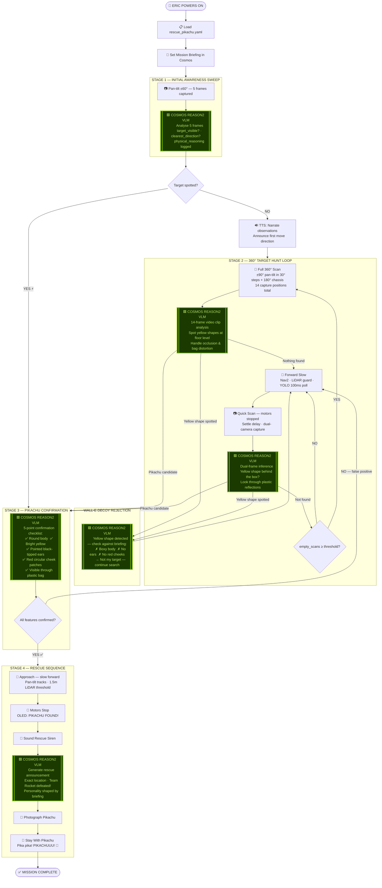

```mermaid
flowchart TD

    START(["🤖 ERIC POWERS ON"])
    LOAD["📋 Load rescue_pikachu.yaml"]
    SET_BRIEF["📡 Set Mission Briefing in Cosmos"]

    START --> LOAD --> SET_BRIEF

    subgraph SWEEP ["STAGE 1 — INITIAL AWARENESS SWEEP"]
        INIT_SWEEP["📷 Pan-tilt ±60° — 5 frames captured"]
        COSMOS_SWEEP[["🟩 COSMOS REASON2 VLM
        Analyse 5 frames
        target_visible? · clearest_direction?
        physical_reasoning logged"]]
        INIT_SWEEP --> COSMOS_SWEEP
    end

    SET_BRIEF --> SWEEP

    SWEEP_Q{"Target spotted?"}
    COSMOS_SWEEP --> SWEEP_Q
    SWEEP_Q -- "YES ⚡" --> CONFIRM
    SWEEP_Q -- "NO" --> ANNOUNCE["🔊 TTS: Narrate observations
    Announce first move direction"]

    subgraph HUNT ["STAGE 2 — 360° TARGET HUNT LOOP"]
        SCAN_360["🔄 Full 360° Scan
        ±90° pan-tilt in 30° steps + 180° chassis
        14 capture positions total"]
        COSMOS_360[["🟩 COSMOS REASON2 VLM
        14-frame video clip analysis
        Spot yellow shapes at floor level
        Handle occlusion & bag distortion"]]
        MOVE["🚗 Forward Slow
        Nav2 · LiDAR guard · YOLO 100ms poll"]
        QUICK["📷 Quick Scan — motors stopped
        Settle delay · dual-camera capture"]
        COSMOS_QUICK[["🟩 COSMOS REASON2 VLM
        Dual-frame inference
        Yellow shape behind the box?
        Look through plastic reflections"]]
        EMPTY{"empty_scans ≥ threshold?"}

        SCAN_360 --> COSMOS_360
        COSMOS_360 -- "Nothing found" --> MOVE
        MOVE --> QUICK --> COSMOS_QUICK
        COSMOS_QUICK -- "Not found" --> EMPTY
        EMPTY -- "NO" --> MOVE
        EMPTY -- "YES" --> SCAN_360
    end

    ANNOUNCE --> HUNT

    subgraph REJECT ["WALL-E DECOY REJECTION"]
        COSMOS_REJECT[["🟩 COSMOS REASON2 VLM
        Yellow shape detected — check against briefing:
        ✗ Boxy body  ✗ No ears  ✗ No red cheeks
        → Not my target — continue search"]]
    end

    COSMOS_360 -- "Yellow shape spotted" --> COSMOS_REJECT
    COSMOS_QUICK -- "Yellow shape spotted" --> COSMOS_REJECT
    COSMOS_REJECT --> MOVE

    subgraph CONFIRM ["STAGE 3 — PIKACHU CONFIRMATION"]
        COSMOS_CONFIRM[["🟩 COSMOS REASON2 VLM
        5-point confirmation checklist:
        ✅ Round body  ✅ Bright yellow
        ✅ Pointed black-tipped ears
        ✅ Red circular cheek patches
        ✅ Visible through plastic bag"]]
        CONFIRM_Q{"All features confirmed?"}
        COSMOS_CONFIRM --> CONFIRM_Q
    end

    COSMOS_360 -- "Pikachu candidate" --> CONFIRM
    COSMOS_QUICK -- "Pikachu candidate" --> CONFIRM
    CONFIRM_Q -- "NO — false positive" --> MOVE
    CONFIRM_Q -- "YES ✅" --> RESCUE

    subgraph RESCUE ["STAGE 4 — RESCUE SEQUENCE"]
        APPROACH["🚗 Approach — slow forward
        Pan-tilt tracks · 1.5m LiDAR threshold"]
        STOP["🛑 Motors Stop
        OLED: PIKACHU FOUND!"]
        SIREN["🚨 Sound Rescue Siren"]
        COSMOS_ANNOUNCE[["🟩 COSMOS REASON2 VLM
        Generate rescue announcement
        Exact location · Team Rocket defeated!
        Personality shaped by briefing"]]
        PHOTO["📸 Photograph Pikachu"]
        STAY["🤖 Stay With Pikachu
        Pika pika! PIKACHUUU! 🎉"]

        APPROACH --> STOP --> SIREN --> COSMOS_ANNOUNCE --> PHOTO --> STAY
    end

    COMPLETE(["✅ MISSION COMPLETE"])
    STAY --> COMPLETE

    classDef cosmos fill:#1a3a00,stroke:#76b900,stroke-width:3px,color:#b8e060

    class COSMOS_SWEEP,COSMOS_360,COSMOS_QUICK,COSMOS_REJECT,COSMOS_CONFIRM,COSMOS_ANNOUNCE cosmos
```
