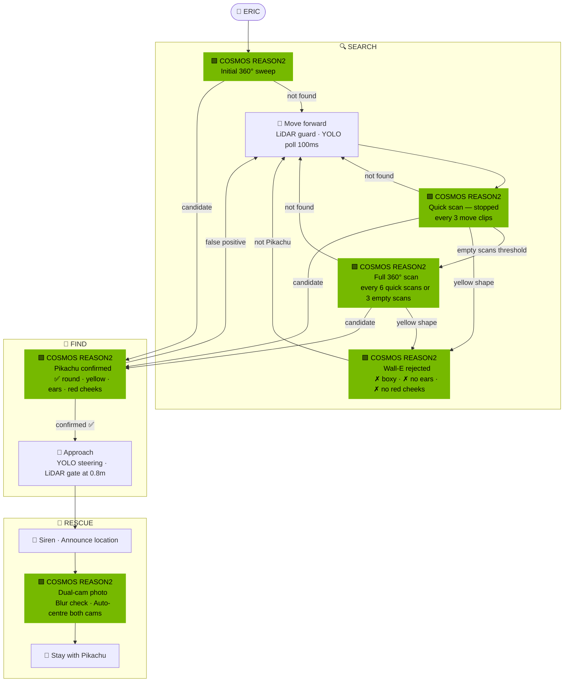

```mermaid
flowchart TD

    START(["🤖 ERIC"])

    subgraph SEARCH ["🔍 SEARCH"]
        SWEEP[["🟩 COSMOS REASON2
        Initial 360° sweep"]]
        MOVE["🚗 Move forward
        LiDAR guard · YOLO poll 100ms"]
        QUICK[["🟩 COSMOS REASON2
        Quick scan — stopped
        every 3 move clips"]]
        SCAN_360[["🟩 COSMOS REASON2
        Full 360° scan
        every 6 quick scans or 3 empty scans"]]
        REJECT[["🟩 COSMOS REASON2
        Wall-E rejected
        ✗ boxy · ✗ no ears · ✗ no red cheeks"]]
    end

    subgraph FIND ["🎯 FIND"]
        CONFIRM[["🟩 COSMOS REASON2
        Pikachu confirmed
        ✅ round · yellow · ears · red cheeks"]]
        APPROACH["🚗 Approach
        YOLO steering · LiDAR gate at 0.8m"]
    end

    subgraph RESCUE ["🚨 RESCUE"]
        SIREN["🚨 Siren · Announce location"]
        PHOTO[["🟩 COSMOS REASON2
        Dual-cam photo
        Blur check · Auto-centre both cams"]]
        STAY["🤖 Stay with Pikachu"]
    end

    START --> SWEEP
    SWEEP -- "not found" --> MOVE
    MOVE --> QUICK
    QUICK -- "not found" --> MOVE
    QUICK -- "empty scans threshold" --> SCAN_360
    SCAN_360 -- "not found" --> MOVE
    QUICK -- "yellow shape" --> REJECT
    SCAN_360 -- "yellow shape" --> REJECT
    REJECT -- "not Pikachu" --> MOVE
    QUICK -- "candidate" --> CONFIRM
    SCAN_360 -- "candidate" --> CONFIRM
    SWEEP -- "candidate" --> CONFIRM
    CONFIRM -- "false positive" --> MOVE
    CONFIRM -- "confirmed ✅" --> APPROACH
    APPROACH --> SIREN --> PHOTO --> STAY

    classDef cosmos fill:#76b900,stroke:#76b900,stroke-width:3px,color:#000000
    class SWEEP,QUICK,SCAN_360,REJECT,CONFIRM,PHOTO cosmos
```
