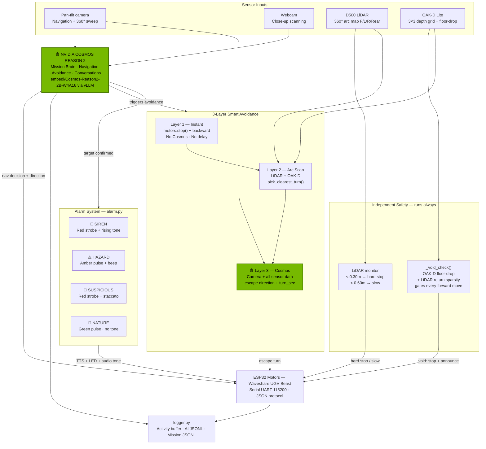
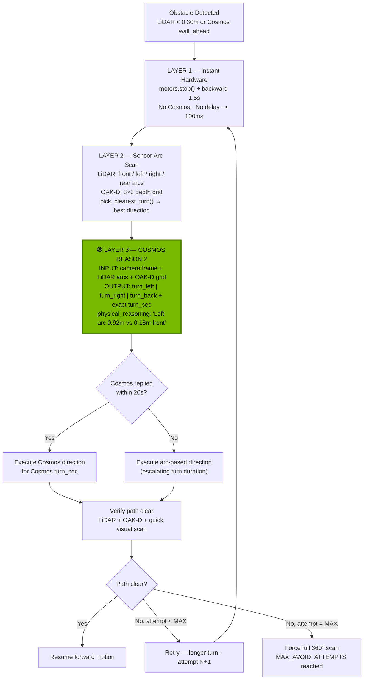
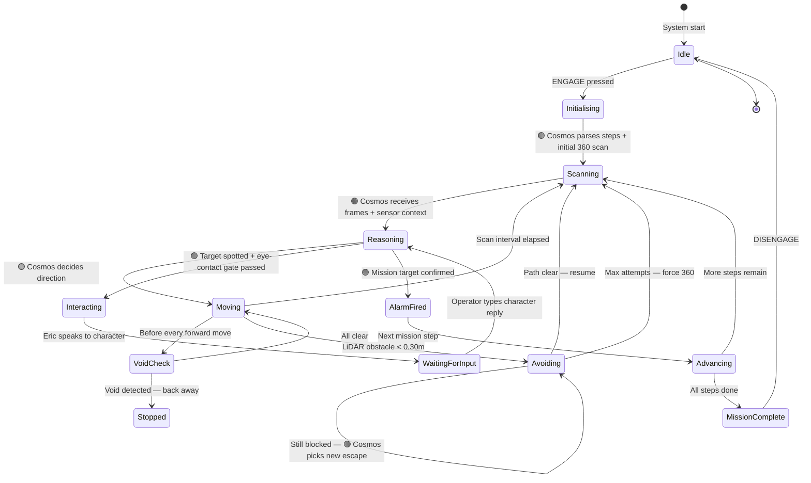

# ERIC — Architecture

← [Back to README](../README.md)

---

## System Overview



---

## Smart Avoidance — Cosmos as Escape Director



---

## Mission State Machine



---

## Project Structure

```
eric/
├── main.py           # Entry point — init Nav2, LiDAR, OAK-D, Cosmos, GUI
├── config.py         # All config via .env
├── cosmos.py         # Cosmos API, camera capture, digital zoom, briefing
├── motors.py         # Waveshare serial: motors + OLED + LED + pan-tilt
├── tts.py            # Piper streaming TTS (CPU, zero VRAM) + gTTS fallback
├── mission.py        # Mission engine: state machine + steps + scans
├── alarm.py          # Multi-modal alert: TTS + LED strobe + pygame tones
├── logger.py         # Structured logging: activity buffer + AI JSONL
├── avoidance.py      # 3-layer smart avoidance — Cosmos as escape director
├── nav2.py           # ROS2 Nav2 integration (graceful fallback)
├── lidar.py          # D500 LiDAR: obstacle monitor + void detection
├── oakd.py           # OAK-D Lite: stereo depth + floor-drop detection
├── gui.py            # Gradio cockpit UI
├── missions/         # YAML mission files
├── logs/             # Auto-created — activity, AI, mission JSONL
├── missions/photos/  # Auto-created — timestamped find photos
└── launch/
    └── cosmos.sh     # vLLM Docker launch script
```

---

## Key Systems

### Void / Drop Detection (3 Layers)

| Layer | What it checks | Void signal |
|---|---|---|
| OAK-D `get_floor_drop()` | Depth at bottom strip of frame (y=0.85) vs mid-frame | Jump > 1.2m or < 5% valid returns |
| LiDAR `lidar_void_ahead()` | Valid return count in front 40° arc | < 15% return ratio = floor gone |
| 🟢 Cosmos `void_ahead` | Visual — lower third of every frame | Stair edge, floor texture ends, open air |

> **Why LiDAR silence = danger:** The D500 scans horizontally at ~20cm height. At a staircase top the laser beam falls through open air — zero returns. Old code treated `999m = clear`. Now, sparse returns = void.

### Terrain-Based Speed Control

Cosmos reports terrain type in every scan result. Eric maps it automatically:

| Tier | Examples | Speed |
|---|---|---|
| Fast | road, tile, floor, concrete, hardwood | `MOTOR_SPEED_FAST` |
| Normal | grass, gravel, dirt, path | `MOTOR_SPEED_NORMAL` |
| Slow | carpet, mud, rocks, slope, wet | `MOTOR_SPEED_SLOW` |
| Impassable | stairs, wall, gap, cliff, water | Full avoidance pipeline |

### Pan-Tilt 360° Scan

| | Old (chassis rotation) | New (pan-tilt sweep) |
|---|---|---|
| Mechanism | 8 × 45° full chassis turns | Pan-tilt sweep + 1 × 180° chassis turn |
| Frames captured | 16 | Up to 42 |
| Time | 45–90s | 15–25s |
| Drift | High | Minimal |

### Async Cosmos Calls

Cosmos calls run in a `ThreadPoolExecutor` with 2 workers — nav checks and 360° scan analysis can overlap. While Cosmos processes frames, Eric continues sensor reads, void checks, motor control, and GUI updates.

---

## Challenges

**Cosmos inference blocks everything.** 5–9 second calls block Python entirely. Solved with `ThreadPoolExecutor` (2 workers) and persistent `_CameraReader` daemon threads per camera that drain the V4L2 buffer continuously — otherwise V4L2 stalls and produces `select() timeout` errors during every Cosmos call.

**V4L2 camera stalls on JetPack 6.2.** `cv2.VideoCapture` fills its kernel buffer when nobody reads. Fix: one daemon thread per camera in a tight `cap.read()` loop, storing the latest frame in a 1-slot buffer. `capture_frame()` just grabs from the buffer. GStreamer pipeline (`v4l2src io-mode=2`, `appsink drop=1 max-buffers=1`) is tried first.

**Void detection was backwards.** Original LiDAR void check treated `999m (no return) = clear`. At a staircase top the laser falls through open air and returns nothing. Fix: count valid returns in the front arc — < 15% ratio = void.

**Motor direction is inverted.** UGV Beast negative speed = forward. Correction layer in `motors.py` so all callers use natural semantics (`forward()`, `backward()`).

**UART byte corruption on JetPack 6.2.** Commands sent as strings occasionally corrupted at the ESP32 end. Fix: send every command byte-by-byte with 1ms inter-byte delay.

**Wide-angle camera loses small objects.** Lego figures are only a few pixels wide at 640×480. Fix: `multi_zoom_scan()` — one wide frame for context plus 4 digitally cropped and upscaled strips in the same Cosmos call.

**Cosmos JSON output is inconsistent.** Sometimes markdown fences, sometimes explanation text, sometimes a list instead of an object. `_parse_json()` handles all cases: strips fences, finds `{...}`, handles array-wrapped objects, falls back to safe defaults rather than crashing the mission loop.

**TTS blocks motor control.** `feed(text).play()` blocks until audio finishes. Fix: dedicated background TTS worker thread and a 1-slot queue. `eric_say()` clears stale items and returns instantly.

**Alarm tones — no internet, no audio files.** All tones generated mathematically at runtime using `struct.pack` to build raw PCM waveforms at 22050 Hz, played via pygame. Zero external files, fully offline.
