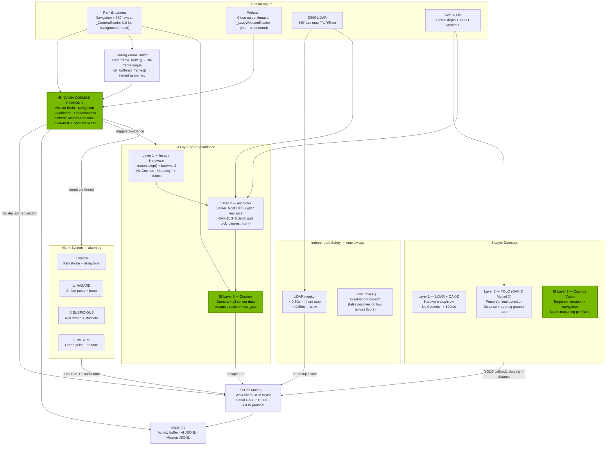
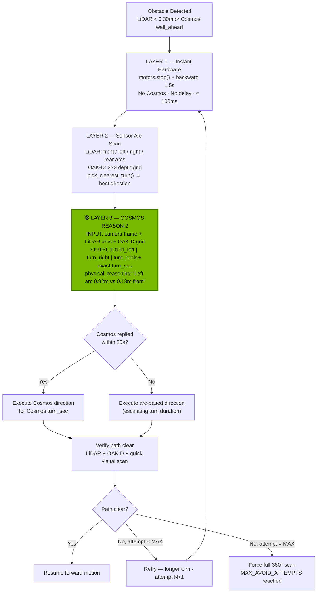
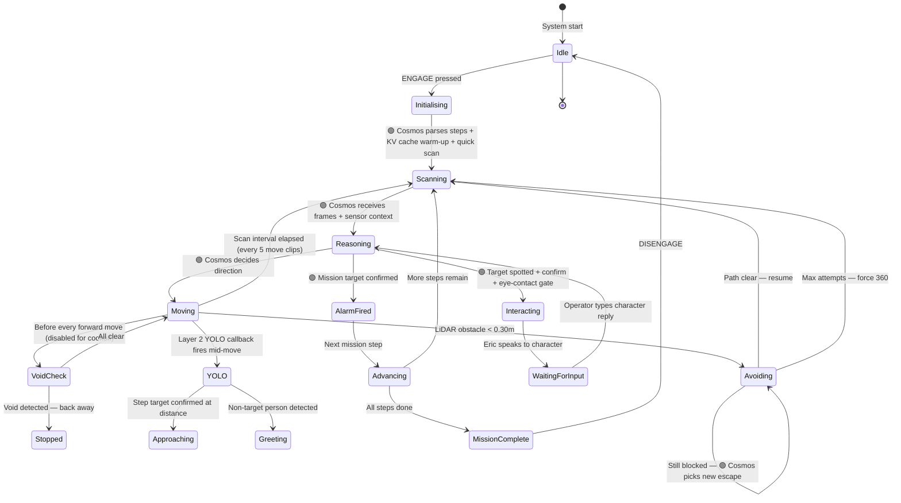

# ERIC — Architecture

← [Back to README](../README.md)

---

## System Overview



---

## Smart Avoidance — Cosmos as Escape Director



---

## Mission State Machine



---

## Project Structure

```
eric/
├── main.py           # Entry point — init Nav2, LiDAR, OAK-D, Cosmos, GUI
├── config.py         # All config via .env
├── cosmos.py         # Cosmos API, camera capture, frame buffer, digital zoom
├── motors.py         # Waveshare serial: motors + OLED + LED + pan-tilt
├── tts.py            # Piper streaming TTS (CPU, zero VRAM) + gTTS fallback
├── mission.py        # Mission engine: MissionState dataclass + steps + scans
├── alarm.py          # Multi-modal alert: TTS + LED strobe + pygame tones
├── logger.py         # Structured logging: activity buffer + AI JSONL
├── avoidance.py      # 3-layer smart avoidance — Cosmos as escape director
├── nav2.py           # ROS2 Nav2 integration (graceful fallback)
├── lidar.py          # D500 LiDAR: obstacle monitor + void detection
├── oakd.py           # OAK-D Lite: stereo depth + YOLO Layer 2 detection
├── gui.py            # Gradio cockpit UI
├── missions/         # YAML mission files
├── logs/             # Auto-created — activity, AI, mission JSONL
├── missions/photos/  # Auto-created — timestamped find photos
└── launch/
    └── cosmos.sh     # vLLM Docker launch script
```

---

## Key Systems

### 3-Layer Detection Pipeline

| Layer | What it does | Technology | Latency |
|---|---|---|---|
| Layer 1 | Obstacle/void — hard stop | LiDAR + OAK-D depth | < 100ms |
| Layer 2 | Person/animal detection with distance + bearing | YOLO on OAK-D Myriad X VPU | ~100ms, runs continuously |
| Layer 3 | Target confirmation, navigation, scene reasoning | Cosmos Reason 2 vision | 5–9s |

**Layer 2 YOLO callback** fires from a background thread in `oakd.py` and sets `_ms.yolo_person_detected`. The mission loop checks this flag on every 100ms poll tick, stops motors, then handles steering and approach logic — all without blocking on Cosmos. YOLO provides hardware stereo depth and bearing, which are more accurate than Cosmos visual estimates.

### MissionState Dataclass

All mutable runtime state lives in a single `_ms = MissionState()` singleton (a dataclass). This replaces 20+ scattered module-level globals with one typed, resettable object. Benefits: thread-safe attribute access, `reset_for_new_mission()` gives a clean slate, `__repr__()` dumps all state in one log line.

External callers (GUI, etc.) import `_ms` directly:
```python
from mission import _ms
if _ms.mission_active: ...
```

### Camera Architecture

| Camera | Reader type | Strategy |
|---|---|---|
| Pan-tilt (primary) | `_CameraReader` (background thread, 10 fps) | Persistent V4L2 drain — prevents kernel buffer stall during Cosmos inference |
| Webcam (confirmation) | `_LazyWebcamReader` (open-on-demand) | Opens V4L2, drains warm-up frames, grabs one frame, closes — releases isochronous USB bandwidth between uses |

**Rolling frame buffer** (`start_frame_buffer` / `get_buffered_frames`): a background thread continuously grabs 160×120 frames from the pan-tilt camera into a 10-frame deque at 1 fps. `_nav_check_async()` grabs the last 6 frames instantly and submits them to Cosmos asynchronously — the mission loop never waits.

### Void / Drop Detection

Void detection is **disabled** for the cookoff build due to false positives on low-texture floors at 15cm mount height. The `_void_check()` function always returns `{void: False}`. Re-enable after cookoff with better sensor tuning. OAK-D floor-drop detection (`get_floor_drop`) is also commented out.

| Layer | What it checks | Status |
|---|---|---|
| OAK-D `get_floor_drop()` | Depth at bottom strip of frame vs mid-frame | Disabled (false positives) |
| LiDAR `lidar_void_ahead()` | Valid return count in front 40° arc | Disabled (horizontal laser unreliable for drops) |
| 🟢 Cosmos `void_ahead` | Visual — lower third of every frame | Active — still checked in prompts |

### 360° Scan Strategies

Two strategies, selected by `scan_strategy` in mission YAML:

| Strategy | Mechanism | Timing | Best for |
|---|---|---|---|
| `target_hunt` (default) | Async frame-per-position — pan-tilt sweeps 7×30° + 180° chassis turn. Inference overlaps with movement. Early-exit on first confirmed target. | ~8–15s | Search & rescue, find missions, security |
| `video_sweep` | Continuous chassis rotation — full 360° while recording video. One single Cosmos call with panoramic clip. No early-exit. | ~17s | Nature explorer, inspection, patrol, survey |

Both fall back to `_scan_360_smart()` (legacy 8×45° chassis rotation) if hardware fails.

### Async Cosmos Calls

Cosmos calls run in a `ThreadPoolExecutor` with 2 workers. The async nav check pipeline:
1. Fire `_cosmos_frames_async()` immediately after capturing buffered frames — returns a `Future` instantly
2. Pan-tilt moves to next position while Cosmos thinks
3. Collect results after all positions captured — most will already be done
4. Cosmos inference and physical movement fully overlap

### KV Cache Warm-up

At mission start, before the acknowledgement call, a tiny `max_tokens=1` request fires with the full system prompt. This forces vLLM to prefill and cache the system prompt + mission briefing. Every subsequent call this mission pays only the delta (scene snapshot), not the full system prompt. Reduces TTFT on Orin Nano W4A16 2B from ~1.5s to ~300ms per call.

### Target Confirmation Pipeline (`_confirm_and_photograph_target`)

When Eric arrives at the target:

1. **Full body confirm at low tilt** (−5°) — Cosmos checks if person matches description
2. **Tilt sweep** (−15° → 0° → +10° → +20° → +25°) — Cosmos checks at each angle if face is visible
3. **Eye contact gate** — waits in silence for direct gaze (up to 8 attempts × 3s)
4. **Greet** — Cosmos generates in-character greeting
5. **Dual-camera photos** — `_capture_final_photo()` with blur check + Cosmos centre check + pan nudge
6. **Step advance** — `_execute_step_action()` advances to next mission step

### Terrain-Based Speed Control

Cosmos reports terrain type in every scan result. Eric maps it automatically via `TERRAIN_SPEED_MAP` (57 entries). Fuzzy partial-keyword matching handles Cosmos inventions like `rough_grass` or `wet tiles`.

| Tier | Examples | Speed |
|---|---|---|
| Fast | road, tile, floor, concrete, hardwood, linoleum | `MOTOR_SPEED_FAST` |
| Normal | grass, gravel, dirt, path, sand, ground | `MOTOR_SPEED_NORMAL` |
| Slow | carpet, mud, rocks, slope, wet, ramp, uneven | `MOTOR_SPEED_SLOW` |
| Impassable | stairs, wall, gap, cliff, water, steep | Full avoidance pipeline |

### Mission Stop / Cleanup

`stop_mission()` performs 6 cleanup steps to prevent state bleeding between missions:

1. `_ms.reset_for_new_mission()` — wipes all runtime state
2. Cancel `pending_nav` future — prevents stale nav result in next mission's first loop
3. `stop_alarm()` — ensures alarm from a find doesn't carry over
4. Recycle `_cosmos_executor` — cancels zombie Cosmos threads (root cause of Jetson overload after 3 missions)
5. Flush vLLM KV cache via `/reset_prefix_cache` — releases GPU memory from previous context
6. `gc.collect()` — releases numpy arrays, base64 frames, completed futures

---

## Challenges

**Cosmos inference blocks everything.** 5–9 second calls block Python entirely. Solved with `ThreadPoolExecutor` (2 workers) and persistent `_CameraReader` daemon threads per camera that drain the V4L2 buffer continuously — otherwise V4L2 stalls and produces `select() timeout` errors during every Cosmos call.

**V4L2 camera stalls on JetPack 6.2.** `cv2.VideoCapture` fills its kernel buffer when nobody reads. Fix: `_CameraReader` — one daemon thread per camera in a tight `cap.read()` loop, storing the latest frame in a lock-protected slot. `capture_frame()` just grabs from the slot. GStreamer pipeline (`v4l2src io-mode=2`, `appsink drop=1 max-buffers=1`) is tried first.

**Webcam burning isochronous USB bandwidth.** Keeping the webcam open at 1 fps continuously reserved a USB isochronous slot on Bus 1, competing with pan-tilt, LiDAR, and OAK-D. Fix: `_LazyWebcamReader` — open device, drain warm-up frames, grab one frame, close immediately.

**Void detection was backwards.** Original LiDAR void check treated `999m (no return) = clear`. At a staircase top the laser falls through open air and returns nothing. Fix: count valid returns in the front arc — < 15% ratio = void. (Disabled for cookoff — false positives on flat floors at 15cm mount.)

**Motor direction is inverted.** UGV Beast negative speed = forward. Correction layer in `motors.py` so all callers use natural semantics (`forward()`, `backward()`).

**UART byte corruption on JetPack 6.2.** Commands sent as strings occasionally corrupted at the ESP32 end. Fix: send every command byte-by-byte with 1ms inter-byte delay.

**Wide-angle camera loses small objects.** Lego figures are only a few pixels wide at 640×480. Fix: `multi_zoom_scan()` — one wide frame for context plus 4 digitally cropped and upscaled strips in the same Cosmos call.

**Cosmos JSON output is inconsistent.** Sometimes markdown fences, sometimes explanation text, sometimes a list instead of an object. `_parse_json()` handles all cases: strips fences, finds `{...}`, handles array-wrapped objects (merging flags with OR logic), remaps field aliases (`"reasoning"` → `"physical_reasoning"`, etc.), falls back to safe defaults rather than crashing the mission loop.

**Cosmos 2B leaks chain-of-thought.** The 2B model sometimes outputs internal monologue before the actual answer. Fix: `_strip_thinking()` detects reasoning-preamble patterns (`"Alright, let me think..."`, `"the user asks..."`) and strips them before TTS.

**TTS blocks motor control.** `feed(text).play()` blocks until audio finishes. Fix: dedicated background TTS worker thread and a 1-slot queue. `eric_say()` clears stale items and returns instantly.

**Alarm tones — no internet, no audio files.** All tones generated mathematically at runtime using `struct.pack` to build raw PCM waveforms at 22050 Hz, played via pygame. Zero external files, fully offline.

**State bleeding between missions.** After 3 missions, Cosmos slows down and old mission context leaks into new one. Fix: `stop_mission()` recycles the thread executor, flushes vLLM KV cache, calls `reset_mission_context()`, and forces Python GC.
