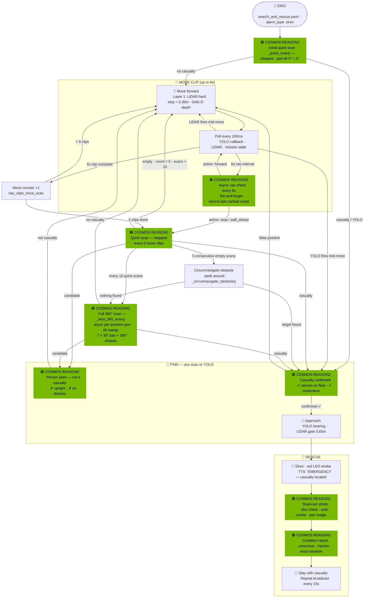

# ERIC — Flow Diagram of the Demo

← [Back to README](../README.md)

---

```mermaid
flowchart TD

    START(["🤖 ERIC
    search_and_rescue.yaml · alarm_type: siren"])

    INIT[["🟢 COSMOS REASON2
    Initial quick scan
    _quick_scan() — stopped · pan-tilt 0° / -5°"]]

    subgraph CLIP ["🚗 MOVE CLIP  (up to 6s)"]
        direction TB
        FORWARD["🚗 Move forward
        Layer 1: LiDAR hard stop < 0.30m · OAK-D depth"]
        POLL["Poll every 100ms
        YOLO callback · LiDAR · mission state"]
        ASYNC[["🟢 COSMOS REASON2
        Async nav check every 6s
        fire-and-forget · returns last cached result"]]
        FORWARD --> POLL
        POLL -- "6s nav interval" --> ASYNC
        ASYNC -- "action: forward" --> POLL
    end

    MOVE_COUNTER["Move counter +1
    nav_clips_since_scan"]

    QUICK[["🟢 COSMOS REASON2
    Quick scan — stopped
    every 5 move clips"]]

    CIRC["Circumnavigate obstacle
    peek around · _circumnavigate_obstacle()"]

    SCAN_360[["🟢 COSMOS REASON2
    Full 360° scan — _best_360_scan()
    async per-position pan-tilt sweep
    7 × 30° pan + 180° chassis"]]

    subgraph FIND ["🎯 FIND — any scan or YOLO"]
        REJECT[["🟢 COSMOS REASON2
        Person seen — not a casualty
        ✗ upright · ✗ no distress"]]
        CONFIRM[["🟢 COSMOS REASON2
        Casualty confirmed
        ✅ person on floor · ✅ motionless"]]
        APPROACH["🚗 Approach
        YOLO bearing · LiDAR gate 0.65m"]
        REJECT -- "not casualty" --> FORWARD
        CONFIRM -- "false positive" --> FORWARD
        CONFIRM -- "confirmed ✅" --> APPROACH
    end

    subgraph RESCUE ["🚨 RESCUE"]
        SIREN["🚨 Siren · red LED strobe
        TTS: 'EMERGENCY — casualty located'"]
        PHOTO[["🟢 COSMOS REASON2
        Dual-cam photo
        blur check · auto-centre · pan nudge"]]
        REPORT[["🟢 COSMOS REASON2
        Condition report
        conscious · injuries · exact location"]]
        STAY["🤖 Stay with casualty
        Repeat broadcast every 15s"]
        SIREN --> PHOTO --> REPORT --> STAY
    end

    START --> INIT
    INIT -- "no casualty" --> FORWARD
    INIT -- "casualty / YOLO" --> CONFIRM

    POLL -- "YOLO fires mid-move" --> CONFIRM
    POLL -- "LiDAR fires mid-move" --> FORWARD
    ASYNC -- "action: stop / wall_ahead" --> QUICK
    POLL -- "6s clip complete" --> MOVE_COUNTER

    MOVE_COUNTER -- "< 5 clips" --> FORWARD
    MOVE_COUNTER -- "5 clips done" --> QUICK

    QUICK -- "candidate" --> REJECT
    QUICK -- "casualty" --> CONFIRM
    QUICK -- "empty · count < 5 · scans < 10" --> FORWARD
    QUICK -- "5 consecutive empty scans" --> CIRC
    QUICK -- "every 10 quick scans" --> SCAN_360

    CIRC -- "target found" --> CONFIRM
    CIRC -- "nothing found" --> SCAN_360

    SCAN_360 -- "no casualty" --> FORWARD
    SCAN_360 -- "candidate" --> REJECT
    SCAN_360 -- "casualty" --> CONFIRM

    APPROACH --> SIREN

    classDef cosmos fill:#76b900,stroke:#76b900,stroke-width:3px,color:#000000
    class INIT,ASYNC,QUICK,SCAN_360,REJECT,CONFIRM,PHOTO,REPORT cosmos
```
