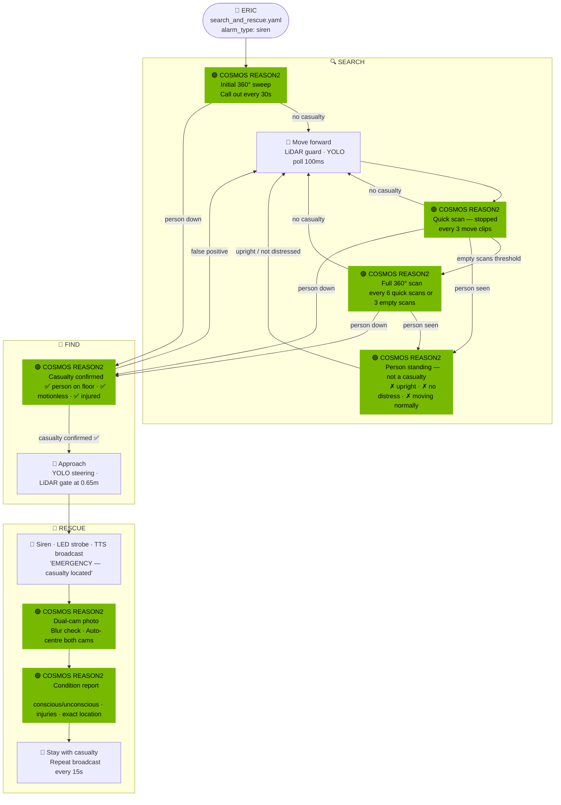

```mermaid
flowchart TD

    START(["🤖 ERIC
    search_and_rescue.yaml
    alarm_type: siren"])

    subgraph SEARCH ["🔍 SEARCH"]
        SWEEP[["🟢 COSMOS REASON2
        Initial 360° sweep
        Call out every 30s"]]
        MOVE["🚗 Move forward
        LiDAR guard · YOLO poll 100ms"]
        QUICK[["🟢 COSMOS REASON2
        Quick scan — stopped
        every 3 move clips"]]
        SCAN_360[["🟢 COSMOS REASON2
        Full 360° scan
        every 6 quick scans or 3 empty scans"]]
        REJECT[["🟢 COSMOS REASON2
        Person standing — not a casualty
        ✗ upright · ✗ no distress · ✗ moving normally"]]
    end

    subgraph FIND ["🎯 FIND"]
        CONFIRM[["🟢 COSMOS REASON2
        Casualty confirmed
        ✅ person on floor · ✅ motionless · ✅ injured"]]
        APPROACH["🚗 Approach
        YOLO steering · LiDAR gate at 0.65m"]
    end

    subgraph RESCUE ["🚨 RESCUE"]
        SIREN["🚨 Siren · LED strobe · TTS broadcast
        'EMERGENCY — casualty located'"]
        PHOTO[["🟢 COSMOS REASON2
        Dual-cam photo
        Blur check · Auto-centre both cams"]]
        REPORT[["🟢 COSMOS REASON2
        Condition report
        conscious/unconscious · injuries · exact location"]]
        STAY["🤖 Stay with casualty
        Repeat broadcast every 15s"]
    end

    START --> SWEEP
    SWEEP -- "no casualty" --> MOVE
    MOVE --> QUICK
    QUICK -- "no casualty" --> MOVE
    QUICK -- "empty scans threshold" --> SCAN_360
    SCAN_360 -- "no casualty" --> MOVE
    QUICK -- "person seen" --> REJECT
    SCAN_360 -- "person seen" --> REJECT
    REJECT -- "upright / not distressed" --> MOVE
    QUICK -- "person down" --> CONFIRM
    SCAN_360 -- "person down" --> CONFIRM
    SWEEP -- "person down" --> CONFIRM
    CONFIRM -- "false positive" --> MOVE
    CONFIRM -- "casualty confirmed ✅" --> APPROACH
    APPROACH --> SIREN --> PHOTO --> REPORT --> STAY

    classDef cosmos fill:#76b900,stroke:#76b900,stroke-width:3px,color:#000000
    class SWEEP,QUICK,SCAN_360,REJECT,CONFIRM,PHOTO,REPORT cosmos
```
